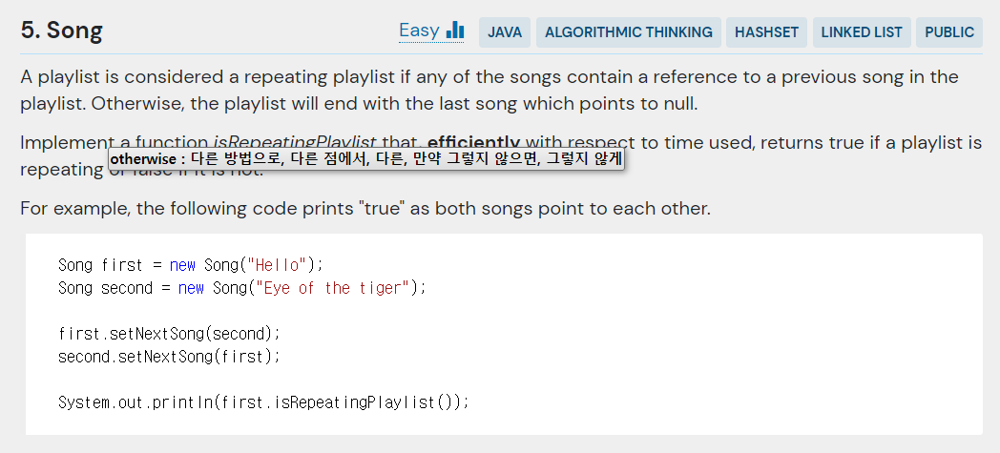

## 문제



- 주어진 코드

```java
public class Song {
    private String name;
    private Song nextSong;

    public Song(String name) {
        this.name = name;
    }

    public void setNextSong(Song nextSong) {
        this.nextSong = nextSong;
    }

    public boolean isRepeatingPlaylist() {
        throw new UnsupportedOperationException("Waiting to be implemented.");
    }

    public static void main(String[] args) {
        Song first = new Song("Hello");
        Song second = new Song("Eye of the tiger");

        first.setNextSong(second);
        second.setNextSong(first);

        System.out.println(first.isRepeatingPlaylist());
    }
}
```

---

## 결과 및 풀이
- 결과 


- 풀이

```java

```

---

## 배웠다
