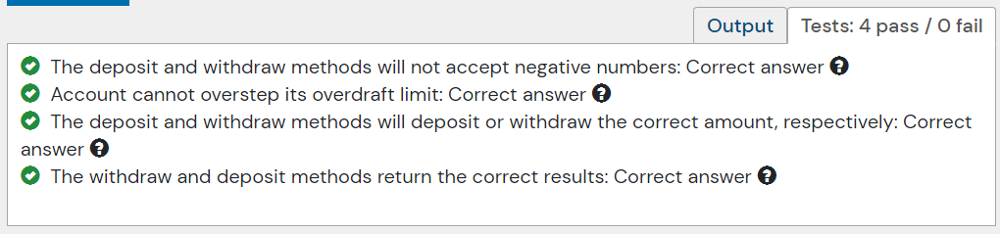

## 문제


- 주어진 코드

```java
import org.junit.Assert;
import org.junit.Test;

public class AccountTest {
    private double epsilon = 1e-6;

    @Test
    public void accountCannotHaveNegativeOverdraftLimit() {
        Account account = new Account(-20);
        
        Assert.assertEquals(0d, account.getOverdraftLimit(), epsilon);
    }
}
```

---

## 결과 및 풀이
- 결과 



- 풀이

```java
public class AccountTest {
    private double epsilon = 1e-6;

    @Test
    public void accountCannotHaveNegativeOverdraftLimit() {
        Account account = new Account(-20);
        Assert.assertEquals(0d, account.getOverdraftLimit(), epsilon);
    }
    
    @Test
    public void accountCannotWithdrawNegativeAmount() {
        Account account = new Account(100);
        Assert.assertFalse(account.withdraw(-10d));
    }
    
    @Test
    public void accountCannotDepositNegativeAmount() {
        Account account = new Account(100);
        Assert.assertFalse(account.deposit(-10d));
    }
    
    @Test
    public void cannotOverstepOverdraftLimit() {
        Account account = new Account(100);
        Assert.assertFalse(account.withdraw(200));
    }
    
    @Test
    public void withdraw() {
        Account account = new Account(100);
        Assert.assertTrue(account.withdraw(20));
    }
    
    @Test
    public void deposit() {
        Account account = new Account(100);
        Assert.assertTrue(account.deposit(20));
    }
    
    @Test
    public void depositAndwithdrawCorrectAmount() {
        Account account = new Account(100);
        account.deposit(50);
        account.withdraw(20);
        Assert.assertEquals(30d, account.getBalance(), epsilon);
    }
    
}
```

---

## 배웠다
- JUnit4 를 사용하기 위해 스프링부트 버전을 2.4.x 에서 2.2.x 로 변경하였다.
- double, float 를 확인하는 경우 Assert.equals(expected, actual, delta) 를 사용한다.
    -- delta는 오차범위를 뜻한다. (ex. 1e-6: 10^-6)
