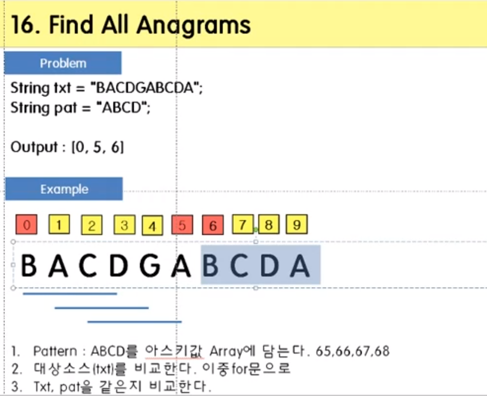

<span class="title__sub1">#. 테스트 문제</span>



---

<span class="title__sub1">#. 결과 및 풀이</span>

<span class="title__sub2">1. 풀이</span>
- 처음엔 문자열 sort를 생각했는데, pattern의 길이가 길면 sort 비용이 클 것이다.
- 문자열의 각 문자를 아스키 코드값으로 바꿔 int[]로 변환하여 비교한다.

```java
@Test
void 아나그램() {
    Assertions.assertArrayEquals(new int[]{0,5,6}, 아나그램_solution("BACDGABCDA", "ABCD"));
}

private int[] 아나그램_solution(String text, String pattern) {

    // 대문자만 들어온다고 가졍하자.
    // 대문자 A-Z까지의 아스키 코드값은 65 ~ 90, 26개
    final int MIN_ASCII = 65, RANGE = 26;
    
    // 패턴 문자열의 각 문자를 아스키 코드값으로 변화하여
    // 해당 index에 카운트를 더한다.
    // 즉, ABCD는 [1,1,1,1,0,0,0,...,0] 이 된다.
    // ABAZ 일 경우 [2,1,0,0,0,...,0,1] 이 된다.
    int[] patternAscii = new int[RANGE];
        for(char alpha : pattern.toCharArray()) {
        patternAscii[alpha-MIN_ASCII]++;
    }
    
    List<Integer> result = new ArrayList<>();
    for(int i=0; i<text.length()-(pattern.length()-1); i++) {
        int[] compareArr = new int[RANGE];
        for(int j=0; j<pattern.length(); j++) {
            compareArr[text.charAt(i+j)-MIN_ASCII]++;
        }
        
        boolean isAnagram = true;
        for(int j=0; j<26; j++) {
            if(patternAscii[j] != compareArr[j]) {
                isAnagram = false;
                break;
            }
        }
        if(isAnagram)
            result.add(i);
    }
    
    return result.stream().mapToInt(i->i).toArray();

}
```

---

<span class="title__sub2">배웠다</span>
- 문자열 비교를 위와 같이 아스키 코드값으로 할 수도 있구나.
