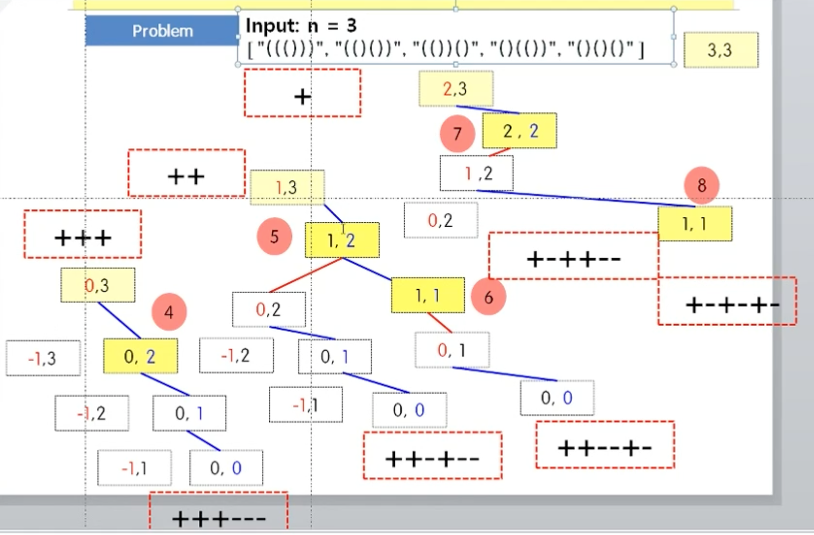

<span class="title__sub1">#. 테스트 문제</span>
- input n개의 괄호로 나올 수 있는 모든 모양을 출력하는 문제
- input : 3
- output : ["((()))", "(()())", "(())()", "()(())", "()()()"]



---

<span class="title__sub1">#. 결과 및 풀이</span>

<span class="title__sub2">1. 풀이</span>
   
```java
@Test
void generatedParentheses() {
    Assertions.assertArrayEquals(new String[]{"((()))", "(()())", "(())()", "()(())", "()()()"}, generatedParentheses_solution(3));
}

String[] generatedParentheses_solution(int n) {
    List<String> result = new ArrayList<>();
    dfs(result, "", n, n);
    return result.stream().toArray(String[]::new);
}

private void dfs(List<String> result, String str, int left, int right) {
    if(left < 0 || left > right)
        return;
    
    if(left == 0 && right == 0) {
        result.add(str.toString());
        return;
    }
    
    dfs(result, str+('('), left-1, right);
    dfs(result, str+(')'), left, right-1);
}
```

---

<span class="title__sub2">배웠다</span>
- input과 output의 배열 길이가 동일하면 미리 공간을 만들어 놓자!
- input을 활용할 수 있는지 확인하자! (stack에 index만 들어가는 것처럼)
