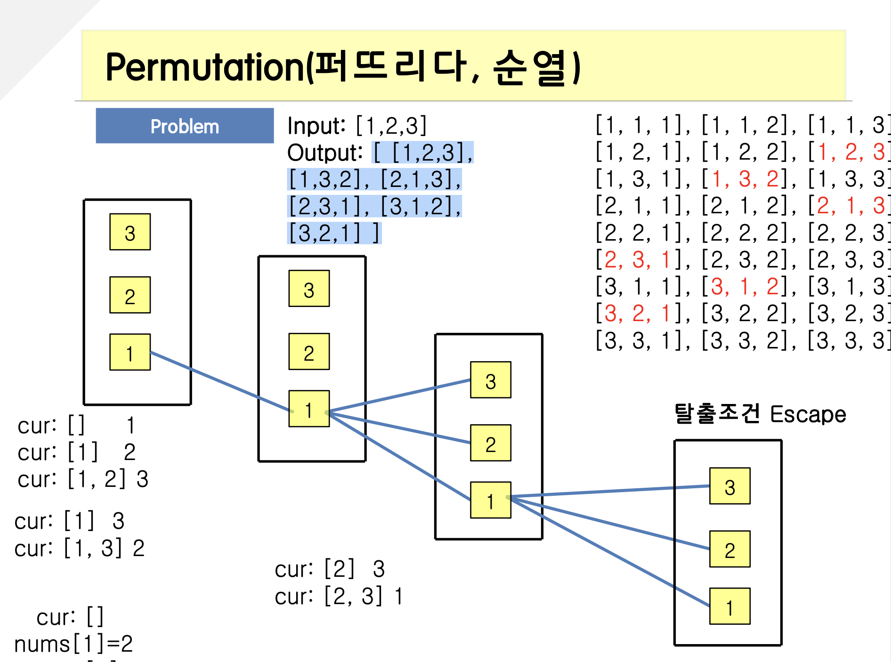

<span class="title__sub1">#. 테스트 문제</span>



---

<span class="title__sub1">#. 결과 및 풀이</span>

<span class="title__sub2">1. 풀이</span>
   
```java
@Test
void permutation_순열() {
    int[][] result = permutation_solution(new int[]{1, 2, 3});
    int[][] expected = { {1,2,3}, {1,3,2}, {2,1,3}, {2,3,1}, {3,1,2}, {3,2,1} };
    for (int i = 0; i < expected.length; i++) {
        Assertions.assertArrayEquals(expected[i], result[i]);
    }
}

int[][] permutation_solution(int[] nums) {

    List<List<Integer>> result = new ArrayList<>();
    List<Integer> list = new ArrayList<>();
    if(nums == null || nums.length == 0)
        return result.stream().map(r -> r.stream().mapToInt(i -> i).toArray()).toArray(int[][]::new);
    permutation_dfs(nums, result, list);
    
    return result.stream().map(r -> r.stream().mapToInt(i -> i).toArray()).toArray(int[][]::new);
}

void permutation_dfs(int[] nums, List<List<Integer>> lists, List<Integer> cur) {
    //담기
    if(cur.size() == nums.length) {
        List<Integer> list = new ArrayList<>(cur);
        lists.add(list);
    }

    //저장, 탈출
    for (int num : nums) {
        if (cur.contains(num))
            continue;
        cur.add(num);
        permutation_dfs(nums, lists, cur);
        cur.remove(cur.size() - 1);
    }
}
```

---

<span class="title__sub2">배웠다</span>
