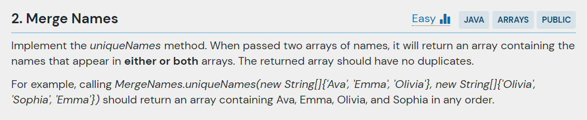
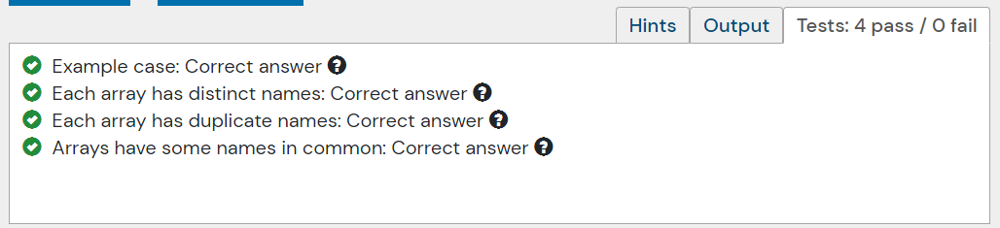

## 문제
- 두 배열의 값을 중복 없이 나열,



- 주어진 코드

```java
public class MergeNames {
    
    public static String[] uniqueNames(String[] names1, String[] names2) {
        throw new UnsupportedOperationException("Waiting to be implemented.");
    }
    
    public static void main(String[] args) {
        String[] names1 = new String[] {"Ava", "Emma", "Olivia"};
        String[] names2 = new String[] {"Olivia", "Sophia", "Emma"};
        System.out.println(String.join(", ", MergeNames.uniqueNames(names1, names2))); // should print Ava, Emma, Olivia, Sophia
    }
}
```

---

## 결과 및 풀이
- 결과 



- 풀이

```java
public String[] uniqueNames(String[] names1, String[] names2) {

    Set<String> uniqueNameSet = new HashSet<>();

    for(int i = 0, name1Len = names1.length, name2Len = names2.length, loopLen = Math.max(name1Len, name2Len);
        i< loopLen; i++) {
      if(name1Len > i) uniqueNameSet.add(names1[i]);
      if(name2Len > i) uniqueNameSet.add(names2[i]);
    }

    return uniqueNameSet.stream().toArray(String[]::new);
  }
```

---

## 배웠다
- 두 수의 크기를 비교할 때 삼항 연산자를 사용했었는데, Math.max() 를 사용하여 간단하게 처리할 수 있다.
- Set 자료구조  
    -- HashSet은 객체의 hashCode() 를 이용하여 저장되어 있는 객체들의 해시 코드와 비교 후(중복 확인) 저정한다.

| | |
|-------|-------|
| HashSet |	순서가 필요없는 데이터를 hash table에 저장. Set 중에 가장 성능이 좋음 |
| TreeSet | 저장된 데이터의 값에 따라 정렬됨. red-black tree 타입으로 값이 저장. HashSet보다 성능이 느림 |
| LinkedHashSet	| 연결된 목록 타입으로 구현된 hash table에 데이터 저장. 저장된 순서에 따라 값이 정렬. 셋 중 가장 느림 |
