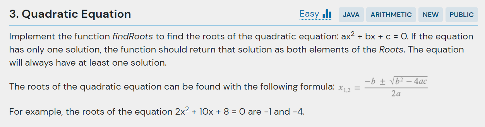
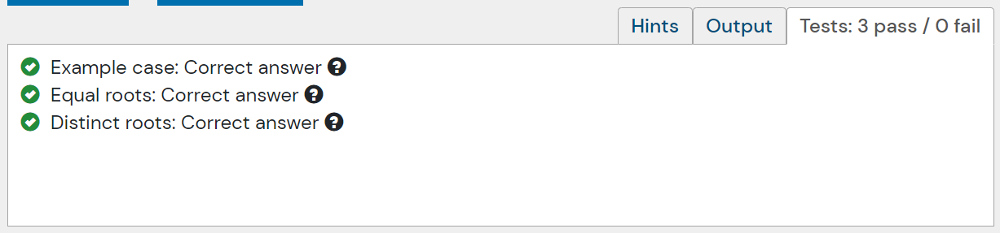

## 문제
- 근의 공식 구하기



- 주어진 코드

```java
public class QuadraticEquation {
    public static Roots findRoots(double a, double b, double c) {
        throw new UnsupportedOperationException("Waiting to be implemented.");
    }
    
    public static void main(String[] args) {
        Roots roots = QuadraticEquation.findRoots(2, 10, 8);
        System.out.println("Roots: " + roots.x1 + ", " + roots.x2);
    }
}

class Roots {
    public final double x1, x2;

    public Roots(double x1, double x2) {         
        this.x1 = x1;
        this.x2 = x2;
    }
}
```

---

## 결과 및 풀이
- 결과 



- 풀이

```java
public Roots findRoots(double a, double b, double c) {
    double sqrt = Math.sqrt(Math.pow(b, 2) - (4*a*c));

    double x1 = (-b + sqrt) / (2*a);
    double x2 = (-b - sqrt) / (2*a);
    
    return new Roots(x1, x2);
}
```

---

## 배웠다
- () 괄호 연산자 신경써야한다. 2*a 괄호 연산자 빼먹어서 틀렸었다.
