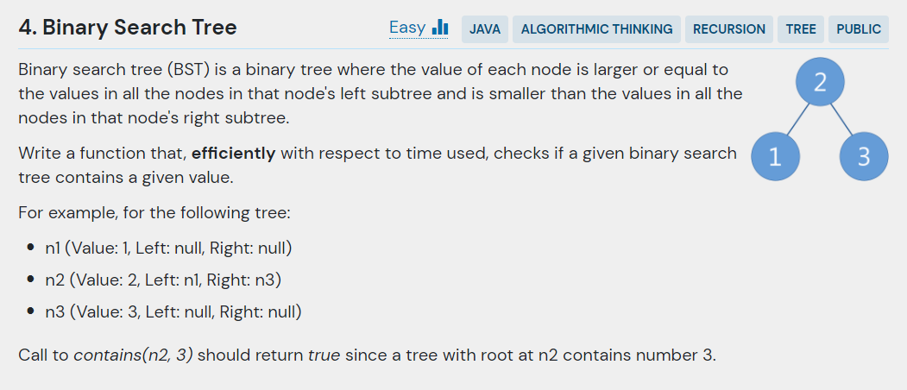
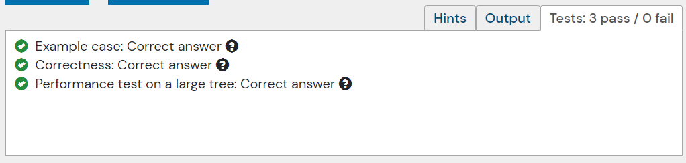

## 문제



- 주어진 코드

```java
class Node {
    public int value;
    public Node left, right;

    public Node(int value, Node left, Node right) {
        this.value = value;
        this.left = left;
        this.right = right;
    }
}

public class BinarySearchTree {
    public static boolean contains(Node root, int value) {
        throw new UnsupportedOperationException("Waiting to be implemented.");
    }
    
    public static void main(String[] args) {
        Node n1 = new Node(1, null, null);
        Node n3 = new Node(3, null, null);
        Node n2 = new Node(2, n1, n3);
        
        System.out.println(contains(n2, 3));
    }
}
```

---

## 결과 및 풀이
- 결과 



- 풀이

```java
public boolean contains(Node root, int value) {
    Node currentNode = root;
    
    while(currentNode != null) {
        int currentValue = currentNode.value;
    
        if(currentValue == value) return true;
        else if(currentValue > value) currentNode = currentNode.left;
        else currentNode = currentNode.right;
    }
    
    return false;
}
```

---

## 배웠다
