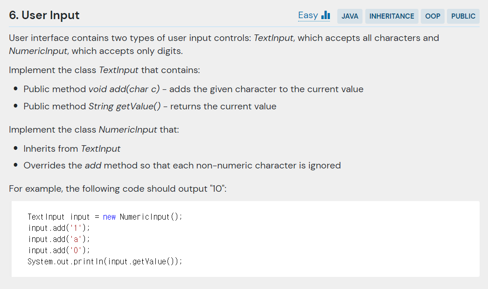

## 문제



- 주어진 코드

```java
public class UserInput {
    
    public static class TextInput {}

    public static class NumericInput {}

    public static void main(String[] args) {
        TextInput input = new NumericInput();
        input.add('1');
        input.add('a');
        input.add('0');
        System.out.println(input.getValue());
    }
}
```

---

## 결과 및 풀이
- 결과 


- 풀이

```java

```

---

## 배웠다
