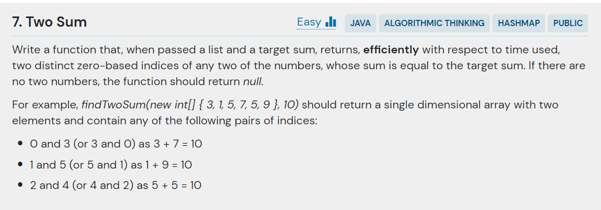

## 문제



- 주어진 코드

```java
public class TwoSum {
    public static int[] findTwoSum(int[] list, int sum) {
        throw new UnsupportedOperationException("Waiting to be implemented.");
    }

    public static void main(String[] args) {
        int[] indices = findTwoSum(new int[] { 3, 1, 5, 7, 5, 9 }, 10);
        if(indices != null) {
            System.out.println(indices[0] + " " + indices[1]);
        }
    }
}
```

---

## 결과 및 풀이
- 결과 


- 풀이

```java

```

---

## 배웠다
