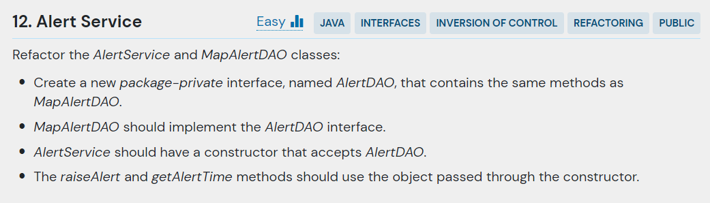

## 문제



- 주어진 코드

```java
import java.util.HashMap;
import java.util.Map;
import java.util.UUID;

class AlertService {
    private final MapAlertDAO storage = new MapAlertDAO();
		
    public UUID raiseAlert() {
        return this.storage.addAlert(new Date());
    }
	
    public Date getAlertTime(UUID id) {
        return this.storage.getAlert(id);
    }	
}

class MapAlertDAO {
    private final Map<UUID, Date> alerts = new HashMap<UUID, Date>();
	
    public UUID addAlert(Date time) {
    	UUID id = UUID.randomUUID();
        this.alerts.put(id, time);
        return id;
    }
	
    public Date getAlert(UUID id) {
        return this.alerts.get(id);
    }	
}
```

---

## 결과 및 풀이
- 결과 


- 풀이

```java

```

---

## 배웠다
