하이퍼커넥트에서 코딩 테스트를 봤다.
생각보다 쉬웠는데.. 마지막 문제에서 performance 에서 걸려서.. 제 시간안에 못풀었다.
결과는 74점으로 탈락 예상이 된다....ㅜㅜ

문제는 총 7문제로, 다지선다 2문제, java 코딩 5문제로 구성되어있었다.

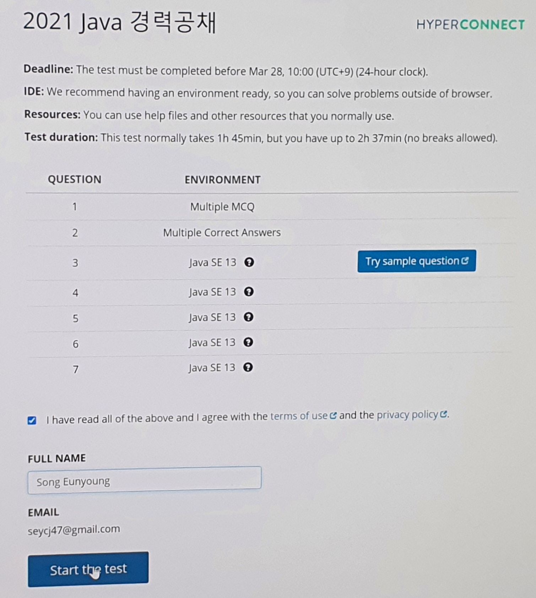

---

## 1번
 - 2진 트리 순회에 대한 문제였다.
 - 첫번째 문제는 전위 순회 (preorder)에 대한 문제 
 - 두번째 문제에 대한 해석이 안됐었다. 추후 다시보니 후위순회에 대한 내용이였네...
 - 세번째 문제는 시간 복잡도에 대한 문제였다. (log n)

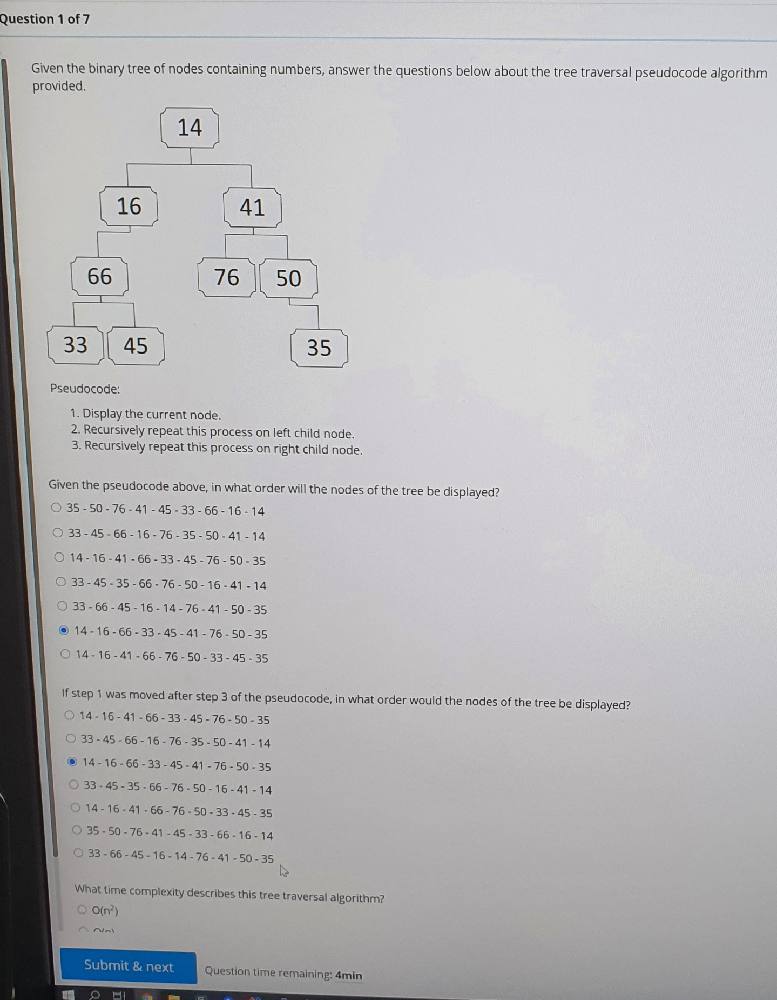

- 트리 순위에 대해 다시한번 정리

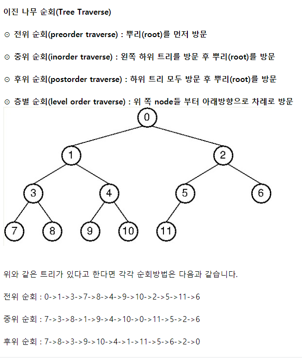

---

## 2번
 - 캡쳐를 깜박했네..
 - 상속에 관련 문제였고, 컴파일 오류가 안나도록 코드를 구성하는 내용이였다.

 ---

## 3번
 - passScore 와 동일하거나 큰 학생의 이름을 리턴하는데, 점수가 높은 순서로 나열한다.
  
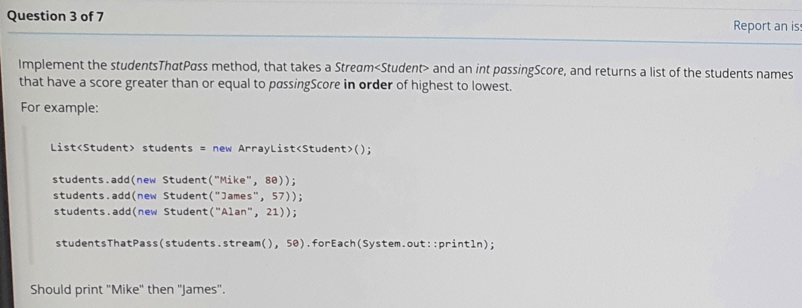

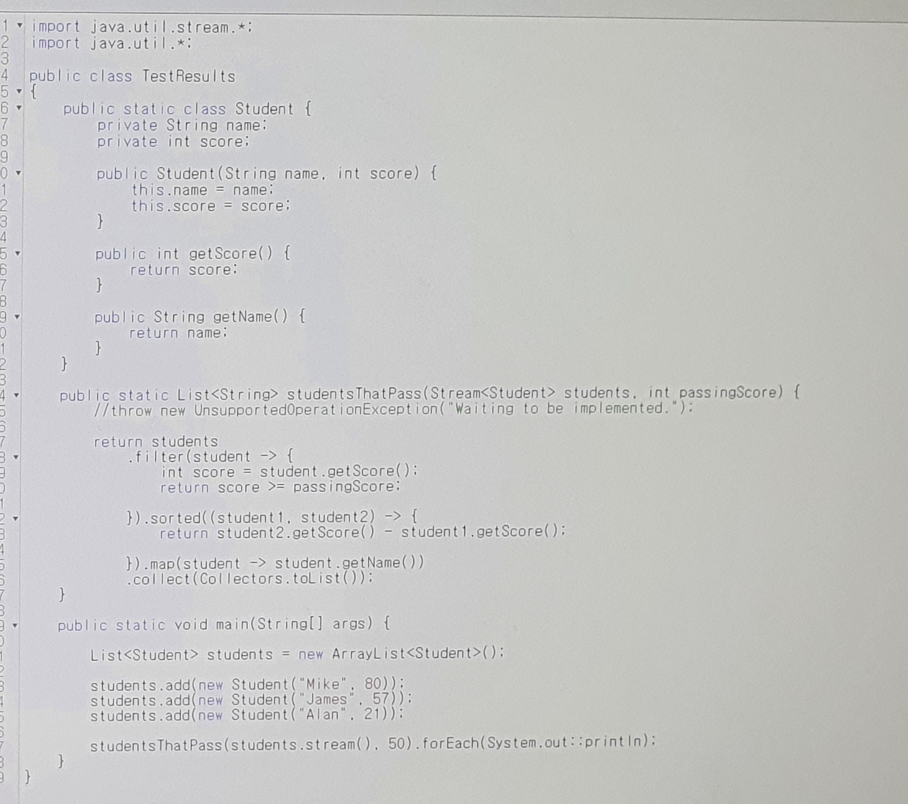
 
---
 
## 4번 
- BookSearch 클래스에 3개 클래스에 대해 Bean을 생성하고, 
- RecommendationService 클래스에서 BookRespository 클래스를 빈주입하여 사용하도록 구성
- 그냥 생성자 주입으로 진행할껄.. 예제에 필드 주입으로 되어있어서 따라하긴 했는데.. 후회된다.

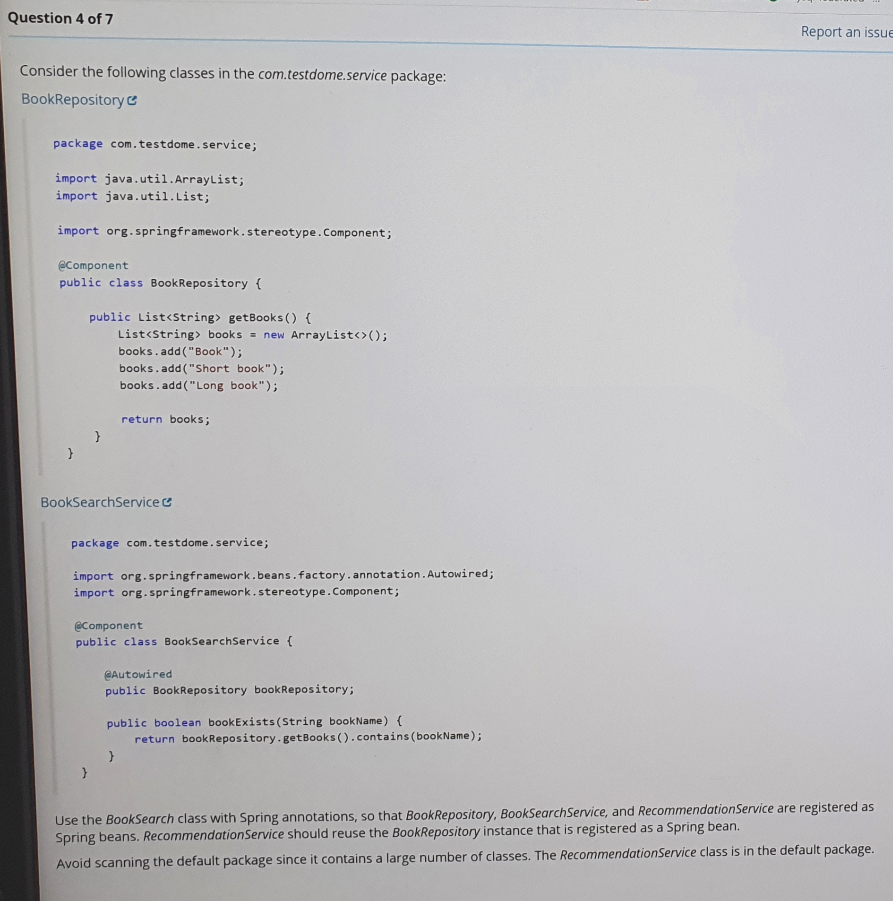

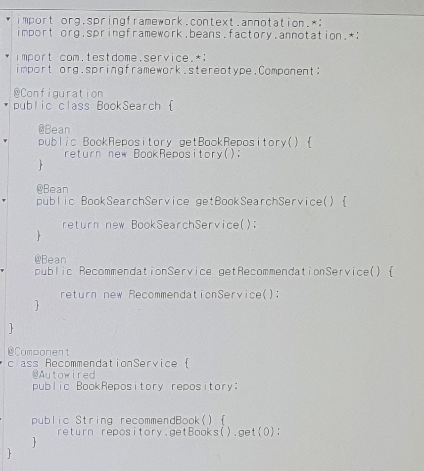

---

## 5번
- RainStorm, SnowStorm 클래스의 부모 클래스를 만드는 문제
- 2번째 사진은 풀기 전이다.

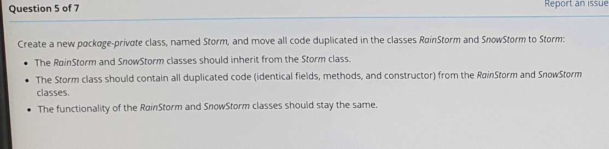

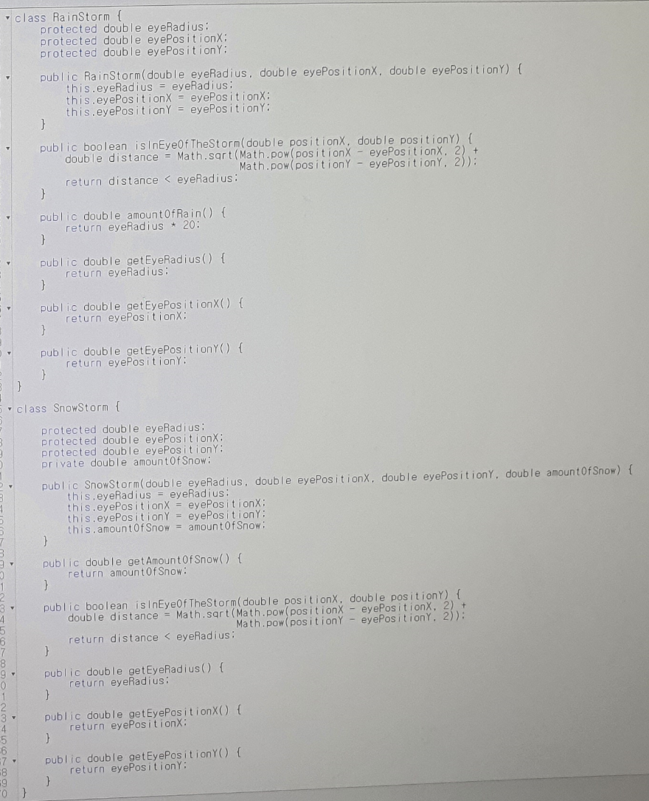

---

## 6번
- 한개만 존재하는 product 중 index 가 낮은 product 출력 문제

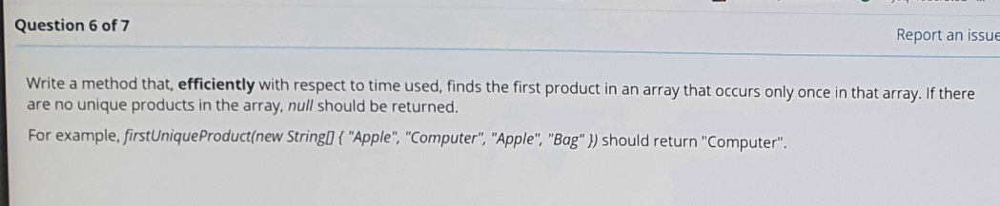

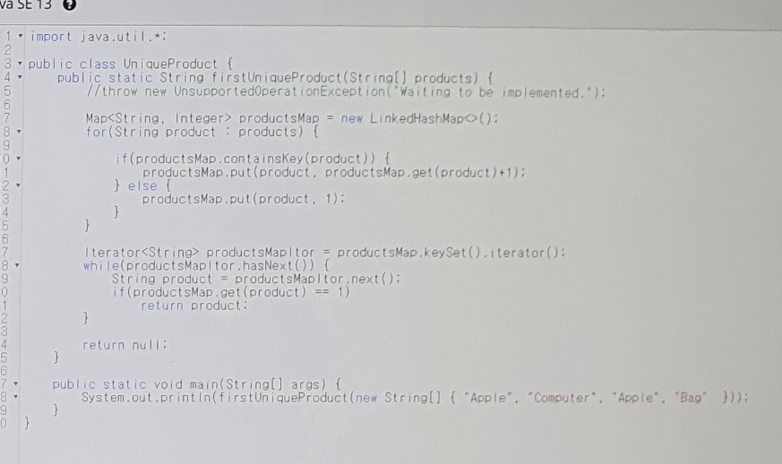

---

## 7번
- 아... 진짜 반성합니다.  
- 조회/ 삭제가 빈번한 자료구조를 찾는데 시간이 오래결렸다.  
    -- ArrayList 의 경우 조회/삭제의 시간복잡도가 O(1)/O(n) 이였고,  
    -- LinkedList 의 경우 조회/삭제의 시간복잡도가 O(n)/O(1) 이기 때문에 뭘 써야할지 고민하다가 시간이 훅 갔네..  
- LinkedList 의 listIterator 를 썼어야 했는데... 시험 종료후 집 가면서 풀었다...ㅜㅜㅜ

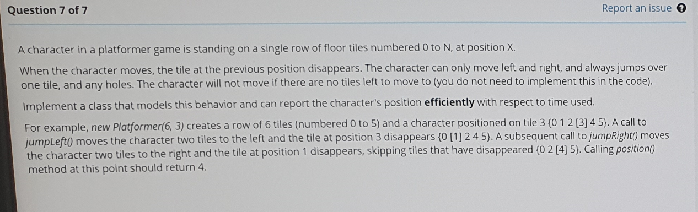

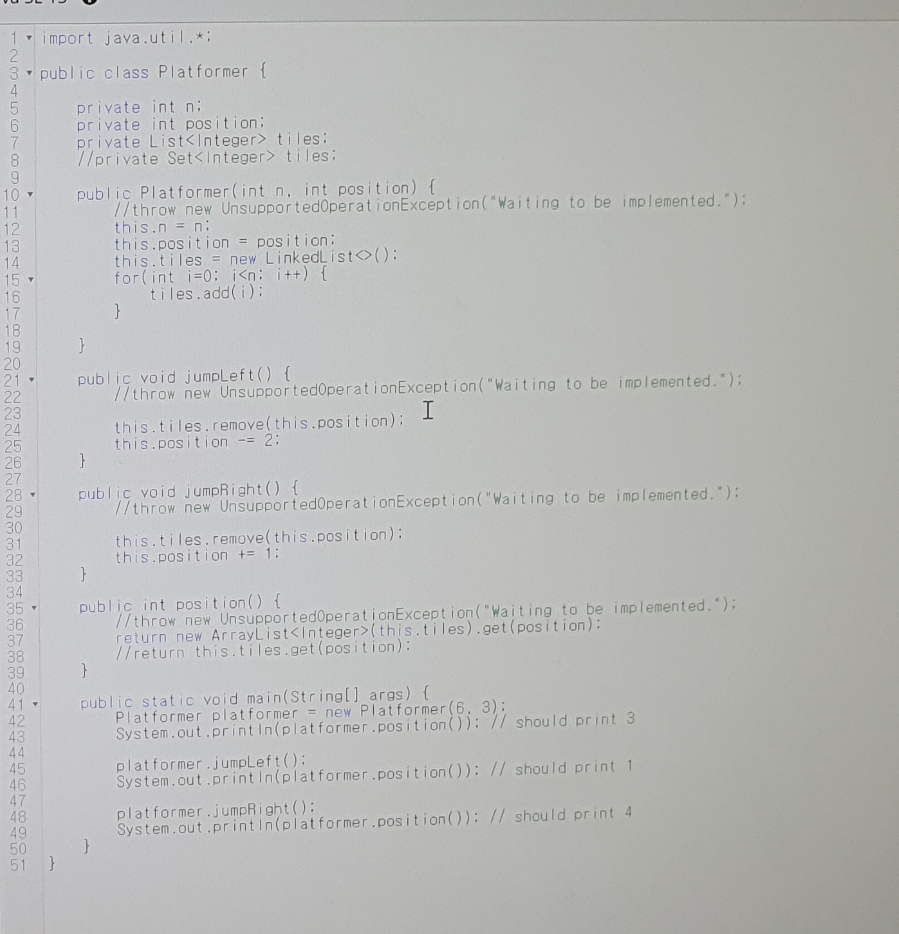

<br>

#### 최종 푼 답
- 이와 같이 진행하면 조회/삭제 모두 O(1)/O(1) 이 된다.

```java
class Platformer {

  private ListIterator<Integer> tilesItor;
  private int current;

  public Platformer(int n, int position) {
    //throw new UnsupportedOperationException("Waiting to be implemented.");
    
    List<Integer> tiles = new LinkedList<>();
    for(int i=0; i<n; i++) {
      tiles.add(i);
    }

    this.tilesItor = tiles.listIterator();
    for(int i=0; i<position; i++) {
      this.tilesItor.next();
    }
    this.current = this.tilesItor.next();
  }

  public void jumpLeft() {
    //throw new UnsupportedOperationException("Waiting to be implemented.");
    this.tilesItor.remove();
    this.tilesItor.previous();
    this.current = this.tilesItor.previous();
  }

  public void jumpRight() {
    //throw new UnsupportedOperationException("Waiting to be implemented.");
    this.tilesItor.remove();
    this.tilesItor.next();
    this.current = this.tilesItor.next();
  }

  public int position() {
    //throw new UnsupportedOperationException("Waiting to be implemented.");
    return this.current;
  }

}

@Test
public void main() {
  Platformer platformer = new Platformer(6, 3);
  System.out.println(platformer.position()); // should print 3

  platformer.jumpLeft();
  System.out.println(platformer.position()); // should print 1

  platformer.jumpRight();
  System.out.println(platformer.position()); // should print 4
}
```

<br>

- ListIterator<E> 메소드

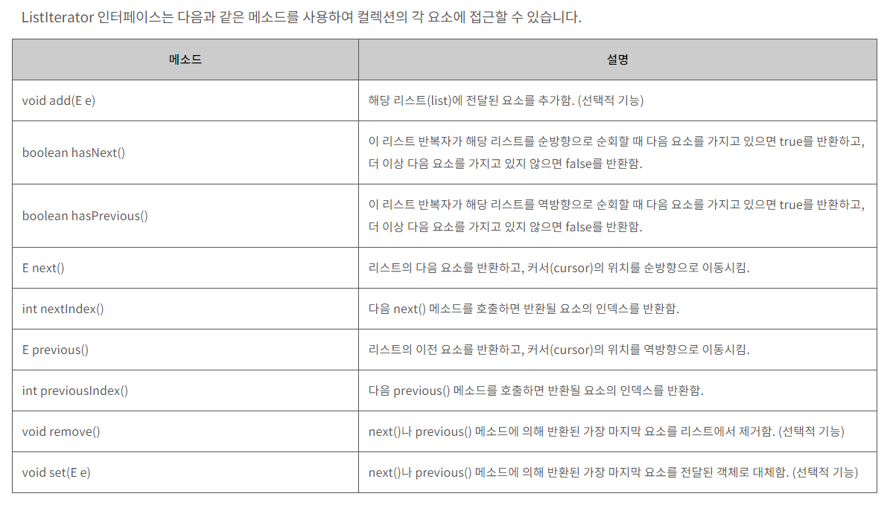
