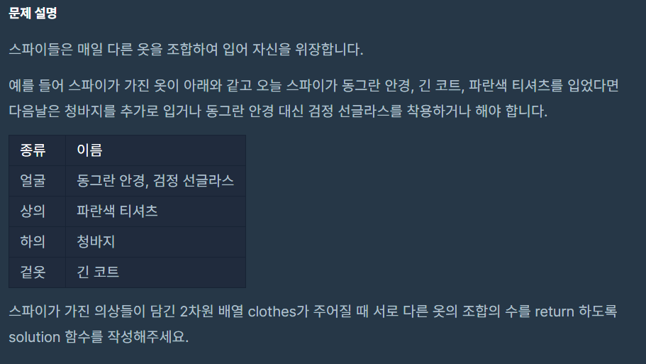

## 문제



- 주어진 코드

```java
class Solution {
    public int solution(String[][] clothes) {
        int answer = 0;
        return answer;
    }
}
```

---

## 결과 및 풀이
- 결과 

```
테스트 1 〉	통과 (0.09ms, 53MB)
테스트 2 〉	통과 (0.09ms, 53MB)
테스트 3 〉	통과 (0.06ms, 52.2MB)
테스트 4 〉	통과 (0.08ms, 53.3MB)
테스트 5 〉	통과 (0.06ms, 51.9MB)
테스트 6 〉	통과 (0.07ms, 52.7MB)
테스트 7 〉	통과 (0.10ms, 53.3MB)
테스트 8 〉	통과 (0.09ms, 53MB)
테스트 9 〉	통과 (0.05ms, 52.4MB)
테스트 10 〉	통과 (0.07ms, 52.4MB)
테스트 11 〉	통과 (0.07ms, 52MB)
테스트 12 〉	통과 (0.07ms, 52.6MB)
테스트 13 〉	통과 (0.10ms, 53.3MB)
테스트 14 〉	통과 (0.07ms, 53.3MB)
테스트 15 〉	통과 (0.06ms, 53.8MB)
테스트 16 〉	통과 (0.05ms, 52.9MB)
테스트 17 〉	통과 (0.09ms, 52.9MB)
테스트 18 〉	통과 (0.06ms, 52.6MB)
테스트 19 〉	통과 (0.06ms, 52.5MB)
테스트 20 〉	통과 (0.06ms, 52.6MB)
테스트 21 〉	통과 (0.06ms, 54.4MB)
테스트 22 〉	통과 (0.06ms, 52.3MB)
테스트 23 〉	통과 (0.06ms, 52.4MB)
테스트 24 〉	통과 (0.06ms, 53.3MB)
테스트 25 〉	통과 (0.07ms, 53.5MB)
테스트 26 〉	통과 (0.09ms, 52.5MB)
테스트 27 〉	통과 (0.09ms, 52.3MB)
테스트 28 〉	통과 (0.07ms, 52MB)
```

- 풀이
    - 해당 문제는 경우의 수 문제이다.
    - A집합의 n개에서 나올 수 있는 부분 집합의 수는 n+1 이다. (n개 + 선택하지 않았을 경우 1)
    - A집합 n개, B집합 m개에서 나올 수 있는 부분 집합의 수는 (n+1)*(m+1)
    - 모두를 선택하지 않는 경우는 없다고 문제에 명시되어 있으니 -1
    - 즉, {(n+1)*(m+1)*...*(k+1)}-1
       
```java
@Test
void 위장() {
    Assert.assertEquals(5, 위장Solution(new String[][]{{"yellowhat", "headgear"}, {"bluesunglasses", "eyewear"}, {"green_turban", "headgear"}}));
    Assert.assertEquals(3, 위장Solution(new String[][]{{"crowmask", "face"}, {"bluesunglasses", "face"}, {"smoky_makeup", "face"}}));
}
int 위장Solution(String[][] clothes) {
    Map<String, Integer> clothesTypes = new HashMap<>();
    
    for(String[] clothe : clothes) {
      String type = clothe[1];
      if(clothesTypes.containsKey(type)) {
        clothesTypes.put(type, clothesTypes.get(type)+1);
      } else {
        clothesTypes.put(type, 1);
      }
    }
    
    int caseOfClothes = 1;
    for (Map.Entry<String, Integer> entry : clothesTypes.entrySet()) {
      caseOfClothes *= (entry.getValue() + 1);
    }
    
    return caseOfClothes-1;
}
```

---

## 배웠다
- 스트림을 잘 쓴 예제가 있었다.
- 공부 좀 해야겠네..

```java
return Arrays.stream(clothes)
        .collect(groupingBy(p -> p[1], mapping(p -> p[0], counting())))
        .values()
        .stream()
        .collect(reducing(1L, (x, y) -> x * (y + 1))).intValue() - 1;
```
