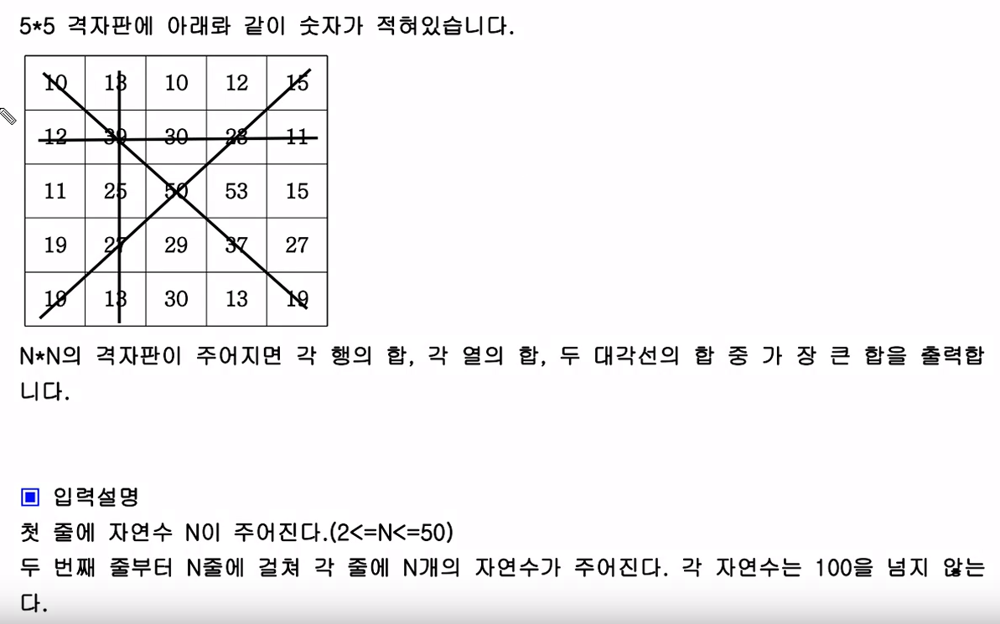

<span class="title__sub1">#. 테스트 문제</span>



---

<span class="title__sub1">#. 결과 및 풀이</span>

<span class="title__sub2">2. 풀이</span>
    - 해당 문제는 모든 행/열의 합을 구할 때, n 번째 loop에서 n 번째 행/열의 값을 모두 구하는게 포인트다.
    - 대각선을 구할때는 arr[n][n], arr[n][n-1-1] 로 해야하는것만 기억하면 될 것 같다.
       
```java

  @Test
  void 격자판_최대합() {
    Assert.assertEquals(
      155,
      격자판_최대합_solution(5, new int[][] {{10, 13, 10, 12, 15}, {12, 39, 30, 23, 11}, {11, 25, 50, 53, 15}, {19, 27, 29, 37, 27}, {19, 13, 30, 13, 19}}));
  }

  int 격자판_최대합_solution(int n, int[][] arr) {

    int maxSum = 0;
    int sumLeftDiagonal = 0;
    int sumRightDiagonal = 0;

    for(int i=0; i<n; i++) {
      // 왼쪽,오른쪽 대각선의 합을 구하기 위해 따로 loop를 돌리지 말고
      // 첫번째 loop에서 구하도록 했다.
      sumLeftDiagonal += arr[i][i];
      // 오른쪽 대각선
      sumRightDiagonal += arr[i][n-1-1];
      int sumRow =0, sumCol = 0;

      for(int j=0; j<n; j++) {
        // n번쨰의 row와 col의 합을 한꺼번에 구한다.
        sumRow += arr[i][j];
        sumCol += arr[j][i];
      }
      maxSum = Math.max(maxSum, sumRow);
      maxSum = Math.max(maxSum, sumCol);
    }

    maxSum = Math.max(sumLeftDiagonal, maxSum);
    maxSum = Math.max(sumRightDiagonal, maxSum);

    return maxSum;
  }
}
```

---

## 배웠다
