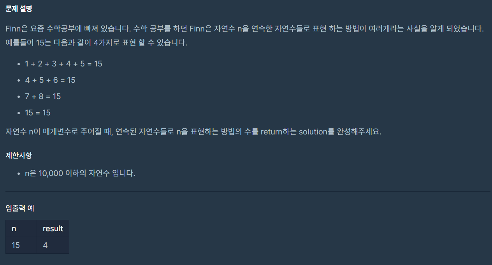

<span class="title__sub1">#. 테스트 문제</span>



<span class="title__sub2">주어진 코드</span>

```java
class Solution {
    public int solution(int n) {
        int answer = 0;
        return answer;
    }
}
```

---

<span class="title__sub1">#. 결과 및 풀이</span>
<span class="title__sub2">1. 결과</span> 
```
정확성  테스트
테스트 1 〉	통과 (0.01ms, 52.5MB)
테스트 2 〉	통과 (0.08ms, 52.1MB)
테스트 3 〉	통과 (0.06ms, 52.2MB)
테스트 4 〉	통과 (0.07ms, 52.4MB)
테스트 5 〉	통과 (0.05ms, 52.5MB)
테스트 6 〉	통과 (0.02ms, 52.4MB)
테스트 7 〉	통과 (0.08ms, 52.7MB)
테스트 8 〉	통과 (0.04ms, 52.6MB)
테스트 9 〉	통과 (0.02ms, 51.8MB)
테스트 10 〉	통과 (0.09ms, 53.8MB)
테스트 11 〉	통과 (0.10ms, 51.9MB)
테스트 12 〉	통과 (0.07ms, 52.4MB)
테스트 13 〉	통과 (0.09ms, 52.9MB)
테스트 14 〉	통과 (0.05ms, 53.1MB)

효율성  테스트
테스트 1 〉	통과 (0.85ms, 53.2MB)
테스트 2 〉	통과 (0.55ms, 52.6MB)
테스트 3 〉	통과 (0.64ms, 52.7MB)
테스트 4 〉	통과 (0.62ms, 52.6MB)
테스트 5 〉	통과 (0.74ms, 52.4MB)
테스트 6 〉	통과 (3.08ms, 52.3MB)
```

<br>

<span class="title__sub2">2. 풀이</span>
- 연속된 자연수의 합이 N 일 경우, 연속된 자연수의 최대수는 (n/2)+1 이다.
- ex) 15일 경우 연속된 자연수의 최대수는 8 (8+7)
    
```java
@Test
void 숫자의_표현() {
    Assert.assertEquals(4, 숫자의_표현_solution(15));
}

public int 숫자의_표현_solution(int n) {
    // 데이터 초기화
    int[] arr = new int[n];
    for(int i=0; i<n; i++)
      arr[i] = i+1;
    
    int caseCnt = 0;
    
    int leftIdx = 0, rightIdx = 0;
    int sum = arr[leftIdx]; // 0번째 값으로 시작한다.
    
    while(leftIdx < n-1) {
      // sum이 작은 경우 오른쪽 이동 후 sum에 합치기
      if (sum < n && rightIdx < n-1)
        sum += arr[++rightIdx];
    
      // sum이 큰 경우 왼쪽 이동 후 sum에서 뺴기
      else if (sum > n)
        sum -= arr[leftIdx++];
    
      // 같은 경우 cnt++, 오른쪽/왼쪽 모두 이동 후 sum 계산
      else {
        caseCnt++;
        if(rightIdx < n-1)
          sum += arr[++rightIdx];
        sum -= arr[leftIdx++];
      }
    }
    
    //자기 자신이 있으므로 +1
    return caseCnt+1;
}
```

---

<span class="title__sub1">#. 배웠다</span>
- 연속된 자연수의 합이 N 일 경우, 연속된 자연수의 최대수는 (n/2)+1 !!!!
