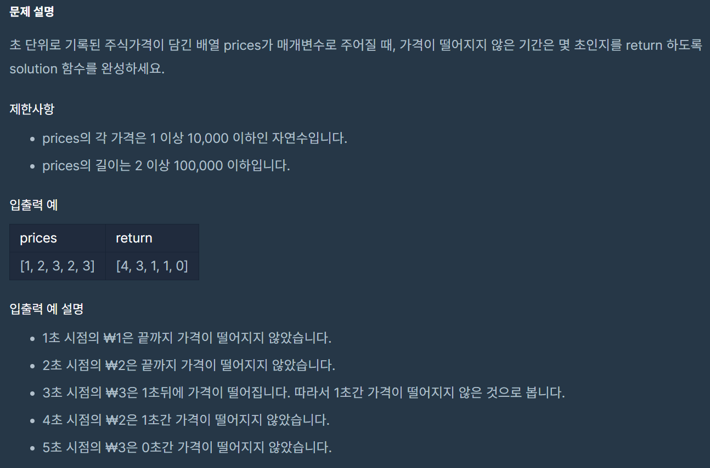

<span class="title__sub1">#. 테스트 문제</span>



---

<span class="title__sub1">#. 결과 및 풀이</span>

<span class="title__sub2">1. 결과</span> 

```
정확성  테스트
테스트 1 〉	통과 (0.18ms, 52.1MB)
테스트 2 〉	통과 (0.37ms, 51.6MB)
테스트 3 〉	통과 (1.59ms, 52.6MB)
테스트 4 〉	통과 (1.85ms, 53.5MB)
테스트 5 〉	통과 (2.08ms, 53.1MB)
테스트 6 〉	통과 (0.25ms, 52MB)
테스트 7 〉	통과 (1.46ms, 53.2MB)
테스트 8 〉	통과 (1.42ms, 53.2MB)
테스트 9 〉	통과 (0.24ms, 52.1MB)
테스트 10 〉	통과 (1.65ms, 52.6MB)

효율성  테스트
테스트 1 〉	통과 (31.70ms, 77MB)
테스트 2 〉	통과 (26.11ms, 66.7MB)
테스트 3 〉	통과 (34.24ms, 75MB)
테스트 4 〉	통과 (33.67ms, 67.5MB)
테스트 5 〉	통과 (22.44ms, 66MB)
```

<br>

<span class="title__sub2">2. 풀이</span>
- input과 output의 배열 길이가 동일하면 미리 공간을 만들어 놓자
- stack 에는 {index,값} 쌍이 들어가는게 아니라 index 값만 들어가는게 포인트
- 값은 price[index] 로 접근할 수 있다.
- prices 배열을 순차적으로 방문하면서 현재 price 값이 stack의 마지막 값보다 작은 경우 pop을 하여 output 배열에 넣어주는게 중요!
       
```java
@Test
void 주식가격() {
    Assertions.assertArrayEquals(new int[]{4,3,1,1,0}, 주식가격_solution(new int[]{1,2,3,2,3}));
}

int[] 주식가격_solution(int[] prices) {
    Stack<Integer> stack = new Stack<>();
    int[] result = new int[prices.length];

    int totalTime = prices.length-1;
    for(int i=0; i<=totalTime; i++) {
        while(!stack.isEmpty() && prices[stack.peek()] > prices[i]) {
            int popIdx = stack.pop();
            result[popIdx] = i - popIdx;
        }
        stack.push(i);
    }

    while(!stack.isEmpty()) {
        int popIdx = stack.pop();
        result[popIdx] = totalTime - popIdx;
    }
    return result;
}
```

---

<span class="title__sub2">배웠다</span>
- input과 output의 배열 길이가 동일하면 미리 공간을 만들어 놓자!
- input을 활용할 수 있는지 확인하자! (stack에 index만 들어가는 것처럼)
