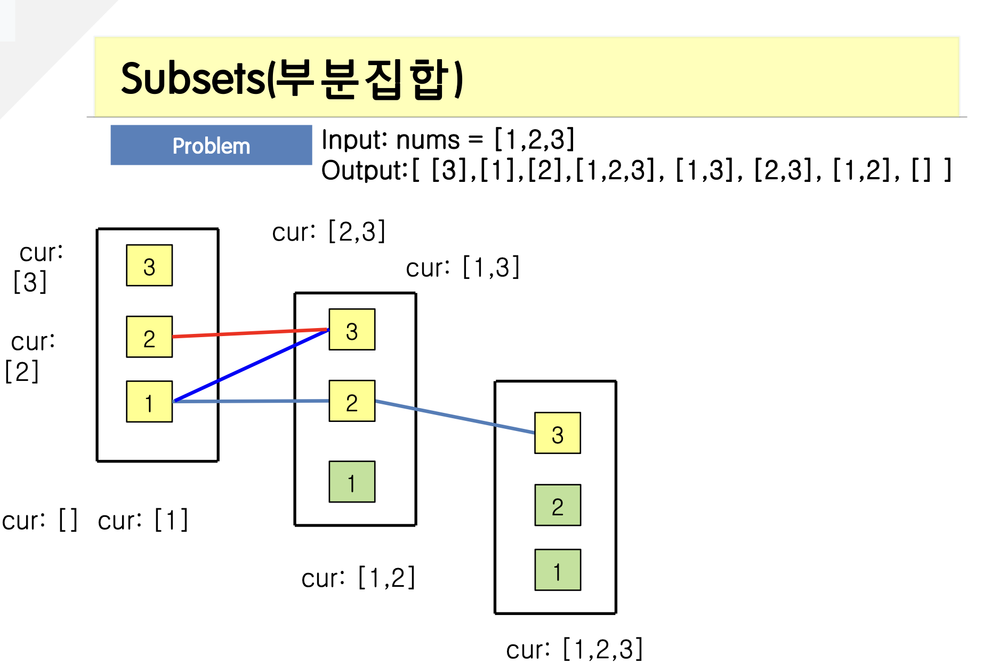

<span class="title__sub1">#. 테스트 문제</span>



---

<span class="title__sub1">#. 결과 및 풀이</span>

<span class="title__sub2">1. 풀이</span>
   
```java
@Test
void subsets_부분집합() {
    int[][] result = subsets(new int[]{1, 2, 3});
    int[][] expected = {{}, {1}, {1,2}, {1,2,3}, {1,3}, {2}, {2,3}, {3}};
    
    for (int i = 0; i < expected.length; i++) {
        Assertions.assertArrayEquals(expected[i], result[i]);
    }

}

int[][] subsets(int[] nums) {
    List<List<Integer>> result = new ArrayList<>();
    List<Integer> list = new ArrayList<>();
    if(nums == null || nums.length == 0) {
        return result.stream().map(r -> r.stream().mapToInt(i -> i).toArray()).toArray(int[][]::new);
    }
    subsetsDfs(result, list, nums, 0);
    
    return result.stream().map(r -> r.stream().mapToInt(i -> i).toArray()).toArray(int[][]::new);
}

private void subsetsDfs(List<List<Integer>> lists, List<Integer> cur, int[] nums, int start) {
    //1.
    List<Integer> list = new ArrayList<>(cur);
    lists.add(list);
    
    //2.
    for (int i=start; i<nums.length; i++) {
        cur.add(nums[i]);
        subsetsDfs(lists, cur, nums, i + 1);
        cur.remove(cur.size() - 1);
    }
}
```

---

<span class="title__sub2">배웠다</span>
- input과 output의 배열 길이가 동일하면 미리 공간을 만들어 놓자!
- input을 활용할 수 있는지 확인하자! (stack에 index만 들어가는 것처럼)
