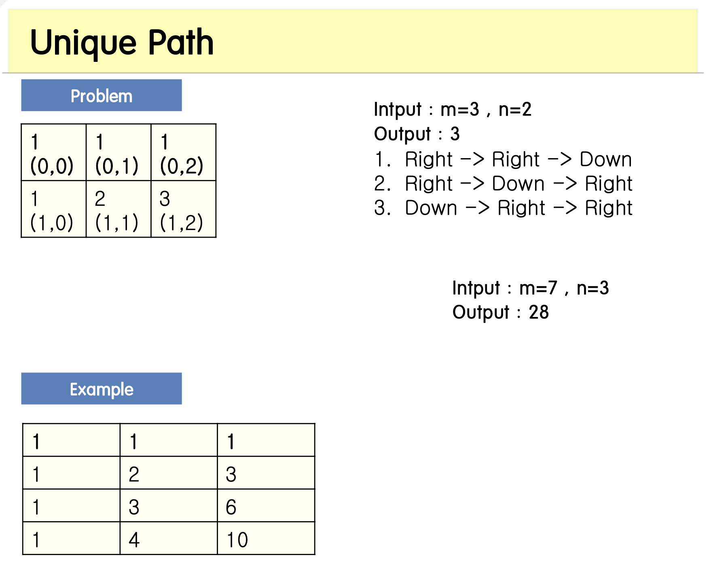

<span class="title__sub1">#. 테스트 문제</span>



---

<span class="title__sub1">#. 결과 및 풀이</span>

<span class="title__sub2">1. 풀이</span>
   
```java
@Test
void uniquePath() {
    Assertions.assertEquals(3, uniquePath_solution(3, 2));
}

private int uniquePath_solution(int m, int n) {
    int [][] map = new int[m][n];
    
    //대각선의 합 이므로 맨 앞 행/열은 0으로 세팅한다.
    for(int i=0; i<m; i++) {
        map[i][0] = 1;
    }
    for(int i=0; i<n; i++) {
        map[0][i] = i;
    }
    
    // 맨 앞 행/열은 0이므로 1부터 시작한다
    for(int i=1; i<m; i++) {
        for(int j=1; j<n; j++) {
            map[i][j] = map[i][j-1] + map[i-1][j];
        }
    }
    return map[m-1][n-1];
}
```

---

<span class="title__sub2">배웠다</span>
