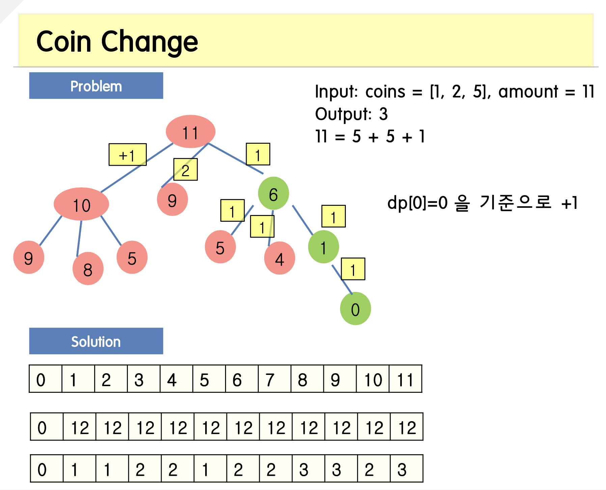

<span class="title__sub1">#. 테스트 문제</span>



---

<span class="title__sub1">#. 결과 및 풀이</span>

<span class="title__sub2">1. 풀이</span>
   
```java
@Test
void CoinChange() {
    Assertions.assertEquals(3, CoinChange_Solution(new int[]{1,2,5}, 11));
}

private int CoinChange_Solution(int[] coins, int amount) {
    
    //1.
    int max = amount + 1;
    int[] dp = new int[max];
    Arrays.fill(dp, max);
    dp[0] = 0;
    
    //2.
    for (int i=0; i<=amount; i++) {
        for(int j=0; j<coins.length; j++) {
            if(i >= coins[j]) {
                dp[i] = Math.min(dp[i], dp[i - coins[j]] + 1);
            }
        }
    }
    return dp[amount] > amount ? -1 : dp[amount];
}
```

---

<span class="title__sub2">배웠다</span>
