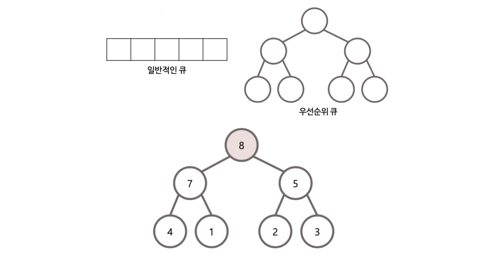

목차
- 문자 다루기 (Character)
- 문자열 다루기 (String)
- 문자열 다루기 (StringBuilder)
- 배열 다루기
- Collections
    - List
    - ArrayList
    - LinkedList
    - stack
    - queue
    - PriorityQueue
    - Set / HashSet
    - Map / HashMap
    - 

## #. 문자 다루기 (Character)
```java
// 숫자인지 확인
Character.isDigit(c);

// 알파벳인지 확인
Character.isAlphabetic(c)
        
//문자이거나 숫자인지 확인
Charactor.isLetterOrDigit(c);
```

<br/>

## #. 문자열 다루기 (String)

```java
String str = "";

str.charAt(int index);
str.indexOf(String find);
str.indexOf(String find, int from);
str.contains(String str); // return boolean

str.toCharArray();
str.split(String regex); // return String[]

//to String
String.valueOf(object);

//exclude end
str.substring(int start, int end);

str.toUpperCase();
str.toLowerCase();
```

<br/>

## #. 문자열 다루기 (StringBuilder)

```java
StringBuilder sb = new StringBuilder();
StringBuilder sb = new StringBuilder(String str);
StringBuilder sb = new StringBuilder(char[] chars);
 
// 삽입
sb.append();
sb.insert(int index, String str);  // 특정 위치에 삽입할때는 insert

// 위치
sb.charAt(int index);
sb.indexOf(String str);

//기타
sb.length();
sb.toString();

sb.substring(int start, int end); //return String

// 아래 함수들은 sb 객체에 변화가 생긴다.
sb.replace(int start, int end, String str); //return this
sb.delete(int start, int end); //return this
sb.reverse(); //return this


```

<br/>

## #. 배열 다루기

```java
// 초기화 방법
new int[]{1, 2. 3. 4};
new String[]{"1", "2", "3"};
Arrays.fill(T[] arr, Object o);

// 정렬
Arrays.sort(T[] arrays)
Arrays.sort(T[] arrays, Collections.reverseOrder());
Arrays.sort(T[] arrays, new Comparator<T>(){
    public int compare(T o1, T o2){ return i;}
})

        
// 변환 - Array to List
Arrays.asList(T[] arrays);   //크기 변경 불가
List converted = new ArrayList(Arrays.asList(arrays)); // 크기변경 가능

// 번환 - List to Array
// list to int[]
int[] array = list.stream().mapToInt(i->i).toArray();


// 검색 - (정렬 후 사용해야 함), 값 중복 시 인덱스는 랜덤으로 나옴
Arrays.binarySearch(T[] arr, Object key)


// 기타
Arrays.copyOf(T[] arr, int length);

```

<br/>


## #. Collections

```java

Collections.sort(collections c);
Collections.sort(collections c, Collections.reverseOrder());
Collections.sort(collections c, new Comparator<T>(){
    @Override
    public int compare(T ob1, T ob2){
        return ob1.target - ob2.target; // assending
    }       

})
```
 
### 1. List

```java
// 초기화 벙법
List.of("", "", ..)


// 기타         
list.size();

list.isEmpty();

list.contains(Object o);

list.add(int index, E element);

list.get(int index);

list.indexOf(Object o);

list.clear();

list.remove(int index);

list.remove(Object o);
``` 

### 2. ArrayList

```java
// 초기화 방법
ArrayList<String> arrayList = new ArrayList<String>(List.of("apple", "grape", "banana", "kiwi"));
ArrayList<String> list = new ArrayList<String>() {{
  add("apple");
  add("grape");
  add("banana");
  add("kiwi");
}};


// 기타 
arraylist.clone();

arraylist.toArray();

arraylist.ensureCapacity(int mincapacity);  // 최소 사이즈 지정

arraylist.trimToSize();  // 사용하지 않는 부분 자르기

``` 

### 3. LinkedList

```java
linkedlist.clone();

linkedlist.toArray();

add(int index, E e) / addFirst() / addLast()

offer(E e) / offerFirst(E e) / offerLast(E e)

get(int index) / getFirst() / getLast()

peek() / peekFirst() / peekLast()  // 반환만

poll() / pollFirst() / pollLast()     // 제거하고 반환

```

### 4. stack

```java
push()

pop()

peek()
```

### 5. Queue

```java
isEmpty()

offer(E e)

peek()

poll()
```

### 6. PriorityQueue
- 일반적으로 우선순위 큐는 최대 힙(max heap)을 이용하여 구현한다.
- max heap은 부모 노드가 자식 노드보다 값이 큰 완전 이진트리를 의미
- 따라서 삽입과 삭제는 O(logN), 정렬은 O(NlogN)
- [custom class에 우선순위 큐 적용하기](/algo/posts/2023-06-11--001)



```java
// 낮은 숫자가 우선 순위인 int 형 우선순위 큐 선언
PriorityQueue<Integer> pq = new PriorityQueue<>()

// 높은 숫자가 우선 순위인 int 형 우선순위 큐 선언        
PriorityQueue<Integer> pq = new PriorityQueue<>(Collections.reverseOrder())

        
// 삽입
pq.addAll(Collections 객체);
pq.add() 또는 offer() // add 함수에서 offer을 호출

        
// 첫번째 값을 반환하고 제거하지 않는다. 큐가 비어있다면 null을 반환
peek()
// 첫번째 값을 반환하고 제거하지 않는다. 큐가 비어있다면 예외 발생
element()
        
// 첫번째 값을 반환하고 제거, 비어있다면 null
poll()

// 첫번째 값 제거, 비어있다면 예외 발생
remove()

// 초기화
clear()

```

### 7. Set / HashSet

```java
set.size();

set.isEmpty();

set.contains(Object o);

set.add(int index, E element);

remove(Object o);
```
 
### 8. Map / HashMap

```java
map.clear()

map.size()

map.containsKey(Object key);

map.containsValue(Object value);

map.get(Object key);

map.getOrDefault(Object key, V defaultValue);

map.keySet();

map.values();

map.put(K key, V value);

map.remove();

map.replaec(K key, V value);


## iterator
# key, value 값이 전부 필요시
Map<Integer, Integer> map = new HashMap<>();
for (Map.Entry<Integer, Integer> entry : map.entrySet()) {
    System.out.println("key:" + entry.getKey() + ", value:" + entry.getValue());
}

# key 만 필요시 (entrySet을 사용할 때보다 약 10% 빠름)
for (Integer key : map.keySet()) {
    System.out.println("key:" + key);
}

# value 만 필요시 (entrySet을 사용할 때보다 약 10% 빠름)
for (Integer value : map.values()) {
    System.out.println("value:" + value);
}
```
