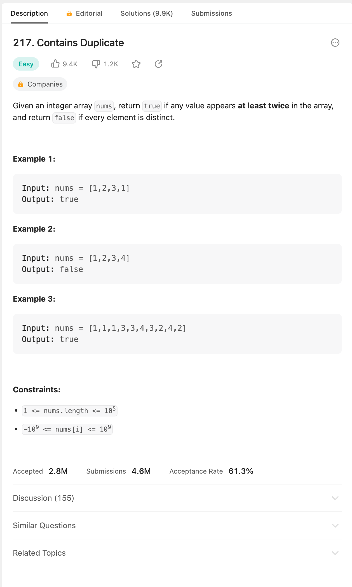

## 문제
- input nums가 주어졌을때, nums 안에 같은 원소가 2개 이상 있을 경우 true, 아니면 false를 반환



- 주어진 코드

```java
public class Test {

    public static void main(String[] args) {
        System.out.println(containsDuplicate(new int[]{1, 2, 3, 1}));
        System.out.println((containsDuplicate(new int[]{1, 2, 3, 4})));
        System.out.println(containsDuplicate(new int[]{1,1,1,3,3,4,3,2,4,2}));
    }

    public static boolean containsDuplicate(int[] nums) {
        //
    }
}
```

---

## 결과 및 풀이
- 풀이

```java
public boolean containsDuplicate(int[] nums) {
    HashSet<Integer> numBucket = new HashSet<>();
    
    for(int num : nums) {
        if (numBucket.contains(num)) {
            return true;
        }
        numBucket.add(num);
    }
    
    return false;
}
```

---

## 배웠다
- 굳이 hashmap을 쓰려고 노력하지 말고 hashset을 쓰자.
