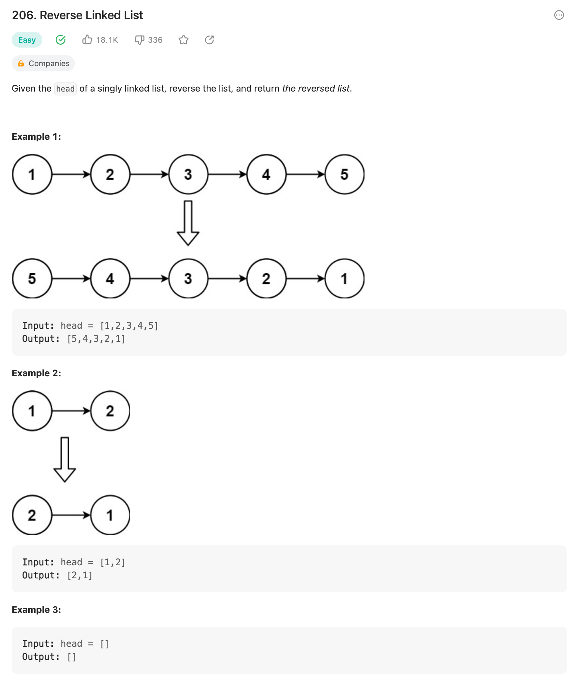
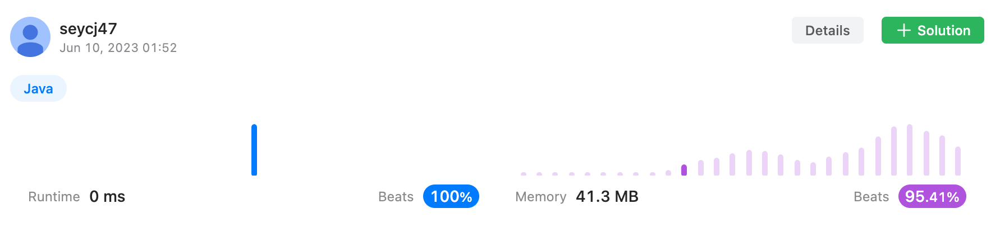

## 문제
- 이진검색



- 주어진 코드

```java
class ListNode {
    int val;
    ListNode next;
    ListNode() {}
    ListNode(int val) { this.val = val; }
    ListNode(int val, ListNode next) { this.val = val; this.next = next; }
}

class Solution {
    public static void main(String[] args) {

        ListNode head = new ListNode(1);
        ListNode cursor = head;
        for (int i = 2; i <= 5; i++) {
            ListNode nextNode = new ListNode(i);
            cursor.next = nextNode;
            cursor = nextNode;
        }
        printNode(head);
        printNode(reverseList(head));
    }

    public static void printNode(ListNode head) {
        while (head != null) {
            System.out.print(head.val + " ");
            head = head.next;
        }
        System.out.println();
    }

    public static ListNode reverseList(ListNode head) {
        //
    }

```

---

## 결과 및 풀이
- 결과



- 풀이

```java
public static ListNode reverseList(ListNode head) {
    ListNode cursor = null;
    
    while (head != null) {
        ListNode nextNode = head.next;
        head.next = cursor;
        cursor = head;
        head = nextNode;
    }
    
    return cursor;
}
```

---

## 배웠다
- 노드 연결이 왜이리 헷갈리는지.. 로직을 쓰면서 그리는게 나한테 맞는듯

