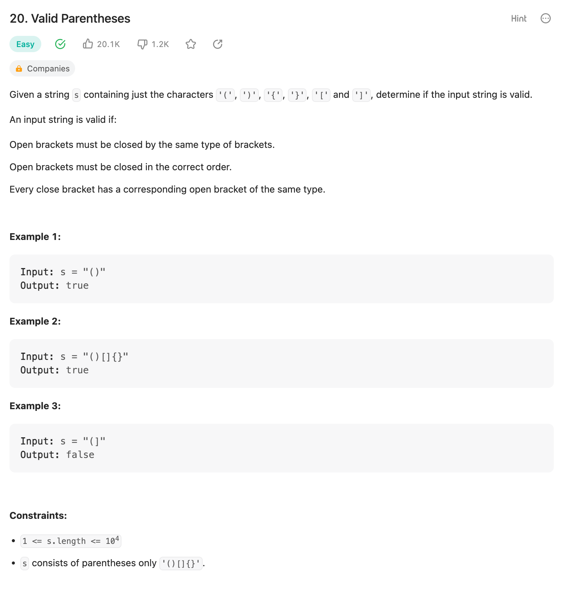
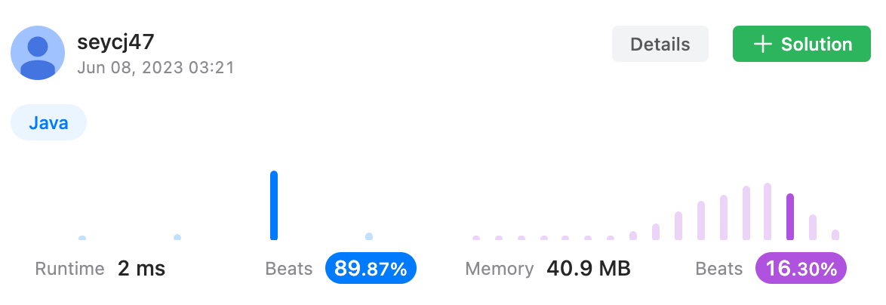

## 문제
- '(', ')', '{', '}', '[', ']'의 determine 이 주어졌을때, 모든 bracket 들이 순서에 맞게 잘 닫혔는지 확인



- 주어진 코드

```java
public class Solution {
    public static void main(String[] args) {
        System.out.println(isValid("()")); // true
        System.out.println(isValid("()[]{}")); // true
        System.out.println(isValid("(]")); // false
        System.out.println(isValid("((())")); // false
        System.out.println(isValid("(")); // false

    }
    public static boolean isValid(String s) {
        //
    }
}

```

---

## 결과 및 풀이
- 결과



- 풀이

```java
public static boolean isValid(String s) {
    Stack<Character> stack = new Stack<>();
    Map<Character, Character> closeDetermineMap = Map.of(
        ')', '(',
        ']', '[',
        '}', '{'
    );
    
    for (char c : s.toCharArray()) {
        Character closed = closeDetermineMap.get(c);
    
        if(closed == null) {
            stack.push(c);
        } else {
            if (stack.isEmpty() || closed != stack.pop()) {
                return false;
            }
        }
    }
    
    if (!stack.isEmpty()) {
        return false;
    }
    
    return true;
}
```

---

## 배웠다
- if 문으로 남발하지 말고, 조건에 hashmap을 사용할 수 있는지 확인을 먼저 해보자.

