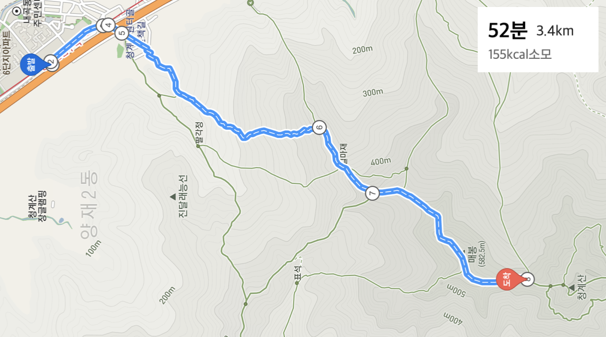
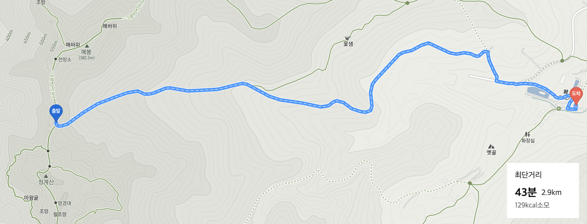

 ■ 4월 23일 청계산   
 ■ 코스 
* 등산  
집 -> 청계산입구역(신분당선) -> 윈터골입구 -> 매봉(582.5m) -> 망경대 (도중 포기) 

* 하산  
망경대 (도중 포기) -> 카페 스테이 -> 옛골 버스정류장 -> 양재역 -> 집

 

 ■ 등산 : 청계산 입구역 -> 매봉 -> 망경대 중간 어디쯤 

 

 ■  하산 : 망경대 중간 어디쯤 -> 카페 스테이 

 

 ■  찰칵 

