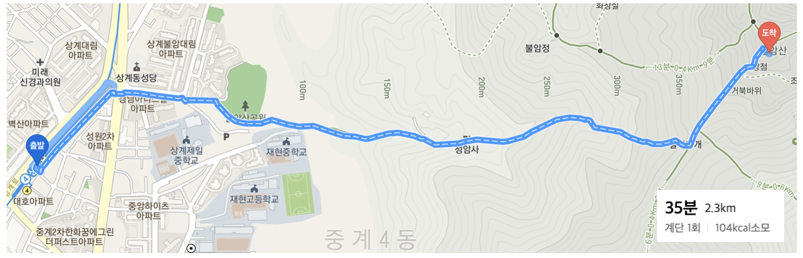
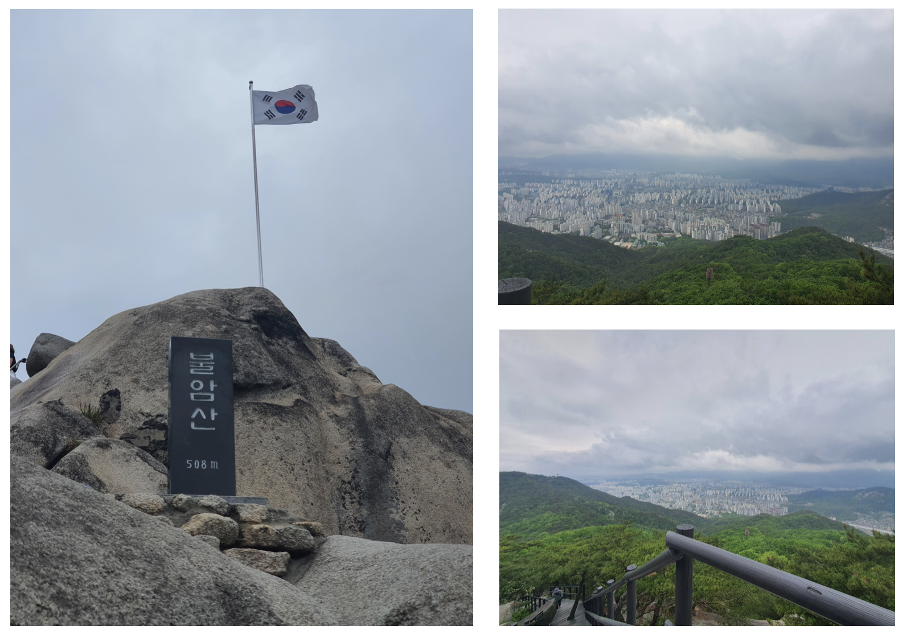

 ■ 5월 07일 불암산   
 ■ 코스 
* 등산: 약 1시간  
상계역(4호선) -> 불암산공원 -> 불암산정상(582.5m)

* 하산: 약 1시간 5분  
불암산정상 -> 불암산공원 -> 상계역(4호선)

 

 ■ 등/하산 : 집 -> 상계역(4호선) -> 불암산공원 -> 불암산정상 

 

 ■  찰칵 

체력이 좀 좋아진듯. 저번에 갔던 청계산보단 힘들지 않게 올라감  
산모기가 많이 보여서.. 조금씩 밖에 못 쉬면서 올라가서 그런건지 생각보다 빨리 올라갔다.  
큰 바위 구간이 2군데 있어서 하산이 더 어려웠다.  
여긴 장갑이 필수이다.  
다음부턴 민망해도 사진을 좀 많이 찍어야겠다. 느무 사진이 없넹..
