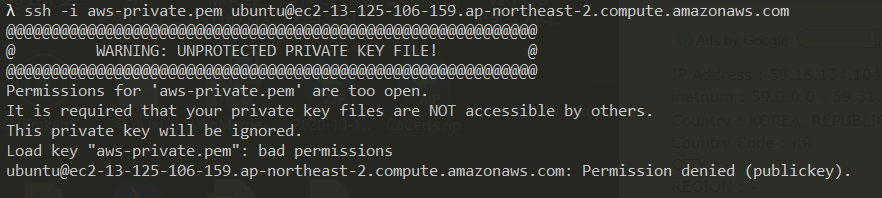
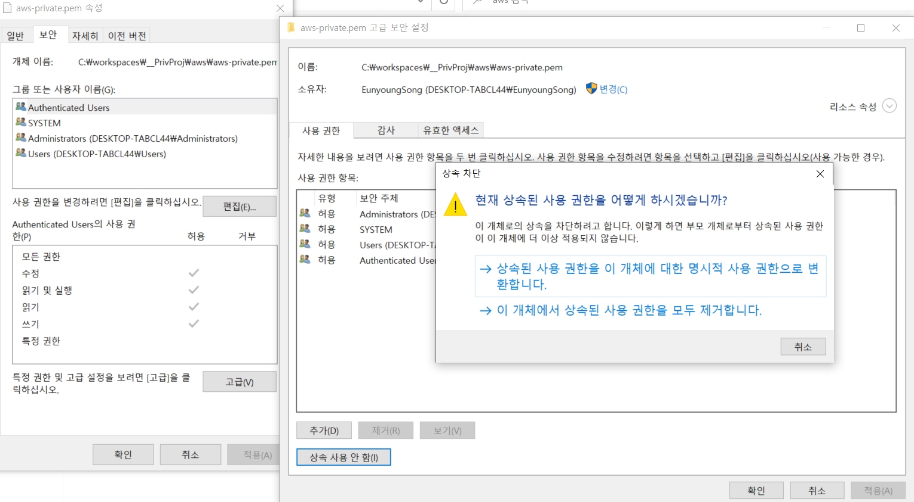
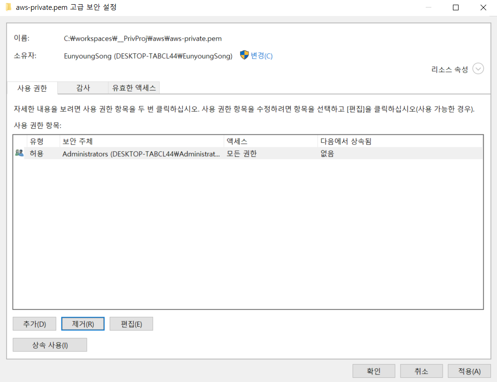
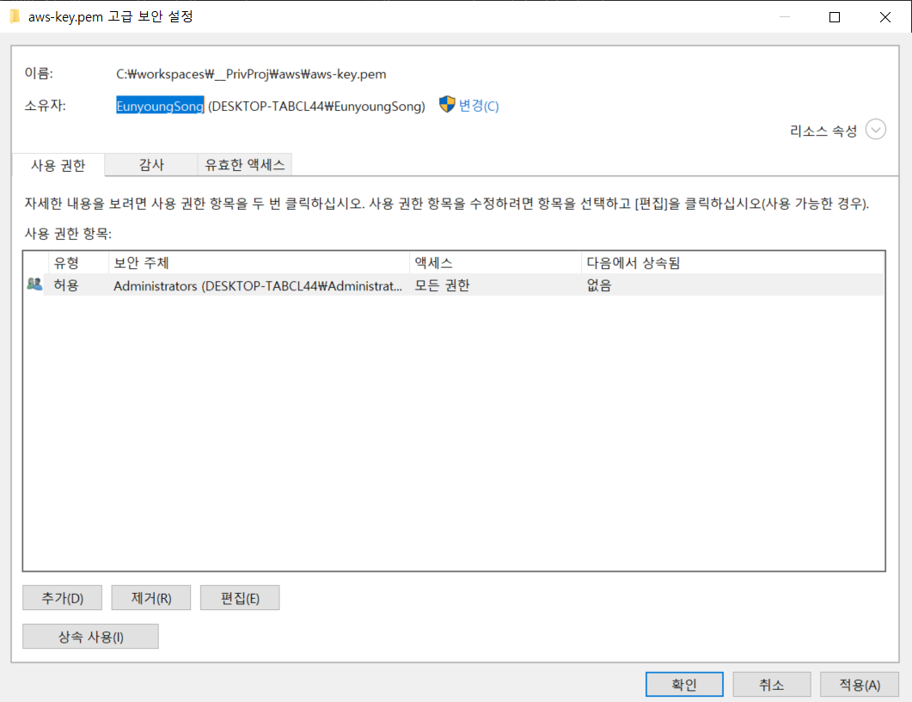
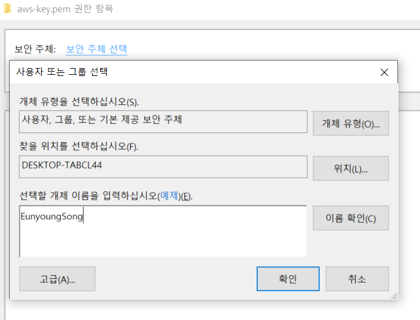
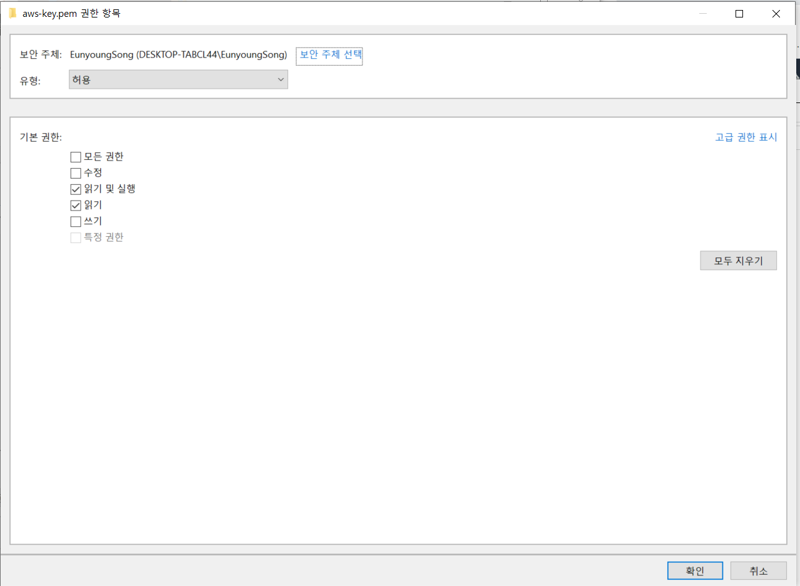
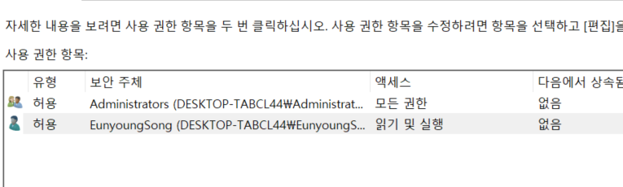

## Problem

##Solution
#### 1. 속성 -> 보안 -> 고급에서 상속 사용안함 클릭 후 명시적 사용 권한으로 변경 

####2. administrators 제외 모두 제거

#### 3. 소유자 복사 -> 추가 -> 보안주체 선택 -> 이름 입력 후 이름 확인

#### 4. 아래와 같이 설정이 됐는지 확인 후 적용

  
