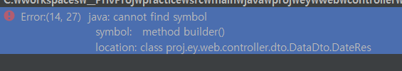
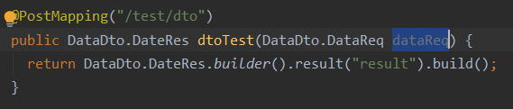
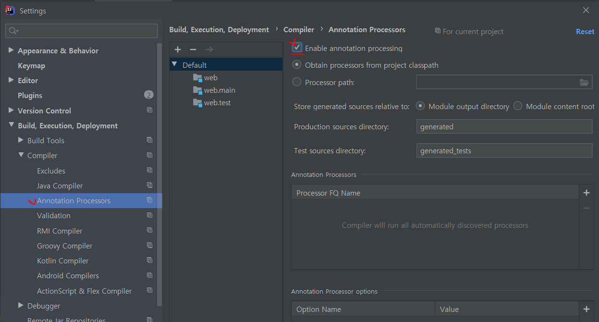

### 문제


Dto 클래스에 @Builder 사용 시 builder() 메소드를 찾을 수 없다는 에러 발생

### 원인
Lombok의 어노테이션을 사용할 경우 컴파일 시 어노테이션을 먼저 스캔해서 코드(getter, setter 등)로 변환해주는 선처리가 필요
또는
IntelliJ에서 "Enable annotation processing" 을 활성화 

#### AnnotationProcessor?
어노테이션 프로세싱은 자바 컴파일러의 컴파일 단계에서, 유저가 정의한 어노테이션의 소스코드를 분석하고 처리하기 위해 사용되는 훅이다. 컴파일 에러나 컴파일 경고를 만들어내거나, 소스코드(.java)와 바이트코드(.class)를 내보내기도 한다.

### 해결
- 1. build.gradle 에 annotationProcessor 추가
```java
annotationProcessor 'org.projectlombok:lombok'
testAnnotationProcessor 'org.projectlombok:lombok' // 테스트 코드에서 lombok 사용 시

```

- 2. IntelliJ File -> Settings 에서 아래 그림과 같이 설정

