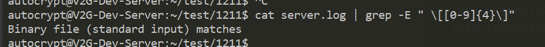

### 문제


grep 명령어 시 "Binary file (standard input) matches" 에러 발생

### 원인
로그파일 grep 할때 텍스트 파일로 인식하지 않고 Binary file 로 인식


### 해결
-a 혹은 --text 옵션 추가

```cmd
$ cat server.log | grep -E " \[[0-9]{4}\]" -a
or
$ cat server.log | grep -E " \[[0-9]{4}\]" --text
```
