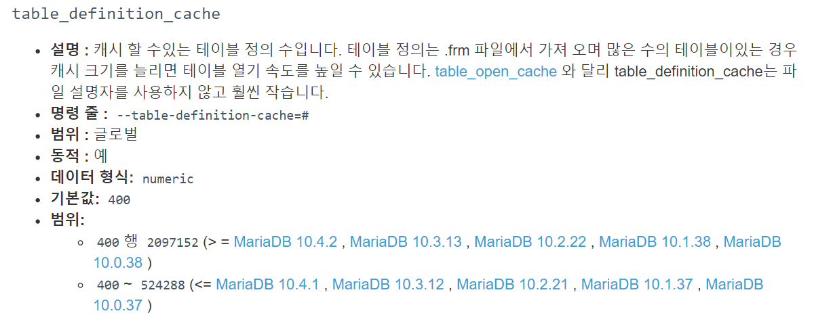

### 문제
- 프로젝트 실행 시 아래와 같은 에러 발생

```
Cause: java.sql.BatchUpdateException: Prepared statement needs to be re-prepared
```

### 원인
- 로컬에 너무 많은 DB/테이블 생성으로 인한 table definition cache 부족


### 해결
- table\_definition_cache 값 변경
- Default 값은 400

변경방법1) 쿼리문 (DB 재시작 시 기본세팅으로 변경됨)

```cmd
MariaDB [(none)]> SHOW VARIABLES LIKE 'table_definition_cache%';
+------------------------+-------+                              
| Variable_name          | Value |                              
+------------------------+-------+                              
| table_definition_cache | 400   |                              
+------------------------+-------+                              
1 row in set (0.001 sec)                                        
                                                                
MariaDB [(none)]> SET GLOBAL table_definition_cache = 600;     
```

변경방법2) my.cnf 수정

```
[mysqld]
table_definition_cache = 400
```

<br>

#### Table Definition Cache?


cf) https://mariadb.com/kb/en/server-system-variables/#table_definition_cache
