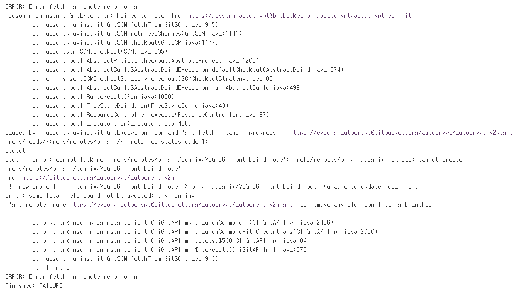
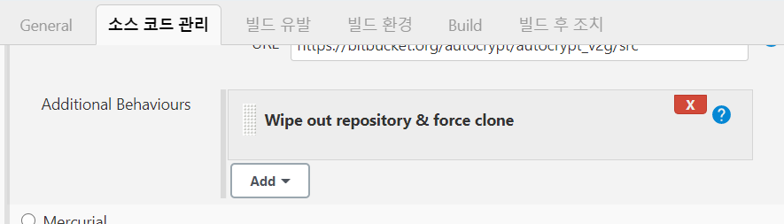
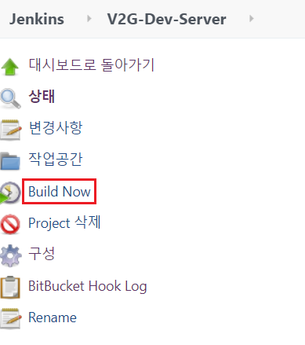

### 문제
- jenkins에 webhook 이벤트 발생 후 아래와 같은 오류 발생

 

### 원인
- origin에 있는 특정 브랜치 삭제 후 fetching이 되지 않아 오류 발생

 

### 해결
- 프로젝트 > 구성 > 소스관리 > Additional Behaviours 에서 Wipe out repository & force clone 추가 후 재빌드 한다.

- 해당 옵션은 webhook 이벤트 발생 시 마다 작업 공간 clean 후 clone 하므로 유지시켜야 할 파일이 있을 경우 백업 또는 이동이 필요하다.  
- 소스 빌드가 완료 됐으면 해당 옵션 제거한다.

