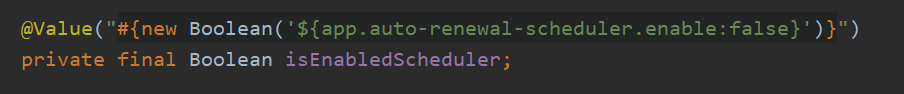
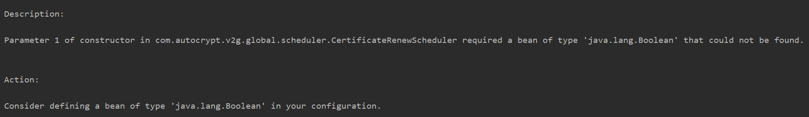

 무엇이 문제였나? 
- @Value 어노테이션을 이용하여 application.properties 변수 접근 시 아래와 같은 오류 발생
- 소스코드

- 에러 발생

 

 원인이 뭔데? 
- 의존성 주입 방식 중 필드 주입 방식(@Autowired 사용) 은 권장하지 않는 패턴이기 때문에 @RequiredArgsConstructor 를 사용하여 생성자 주입방식을 사용했었다.
- final 이 붙었기 때문에 자동으로 생성자 생성시 필요 필드가 되어버렸다.
- 해당 변수는 스프링에서 관리하는 Bean이 아니기 때문에 의존성 자동 주입이 될 수 없다.

 

 이렇게 해결했다! 
- final 제거
- immutable 한 변수가 아닌데... 다른 방법도 찾아서 정리해 놔야곘네...
