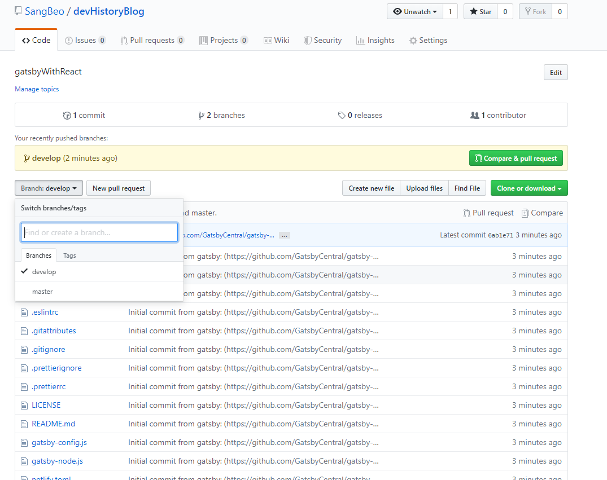
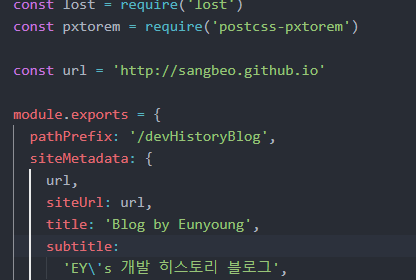

<strong>1. gatsby-cli 설치 및 프로젝트 생성 (lumen 테마 사용)</strong>
```bash
$ yarn add -g gatsby-cli
$ gatsby new devHistoryBlog https://github.com/GatsbyCentral/gatsby-v2-starter-lumen
```

<strong>2. gatsby 로컬 서버 구동 (기본포트 8000)</strong>
```bash
$ cd devHistoryBlog
$ gatsby develop
```

<strong>3. github repository 연동</strong>
```bash
//git remote add origin [repository_url]
$ git remote add origin https://github.com/SangBeo/devHistoryBlog.git
```
 - [브랜치 생성]  
   github 페이지는 최종적으로 master의 파일들이 배포된다.  
   master에서 gatsby 파일 관리와 gh-pages의 빌드를 같이 하니 난잡해서 보기 좋지 않다.  
   그래서 개발은 develop 브랜치에서 진행하고 master 브랜치는 gh-pages로 배포할때만 사용한다  
   -> develop branch : gatsby 파일 구조를 관리  
   -> master : build 된 파일들을 github 페이지에 배포

3.1. develop 브랜치 생성
```bash
//-m 옵션을 이용하여 develop 브랜치로 이동
$ git branch -m develop
```
3.2. 커밋과 푸쉬
```bash
$ git add *
$ commit -m "init commit"
//push 시 -u 옵션을 붙여 이후 push 할때마다 develop 브랜치로 푸쉬한다
$ git push -u origin develop
```
  
그럼 위와 같이 develop 브랜치에 소스 push가 된다.

<strong>4. gh-pages 설치 및 설정 파일 수정, 그리고 Deploy</strong>
```bash
$ yarn add --dev gh-pages
```
4.1. gatsby-config.js 수정

 - url 수정
 - pathPrefix 추가
4.2. package.json 필요시 수정

4.3. Deploy
```bash
//build 및 master branch로 push
$ yarn deploy
```
<strong>5. 실행</strong>
```html
http://sangbeo.github.io/devHistoryBlog
```
