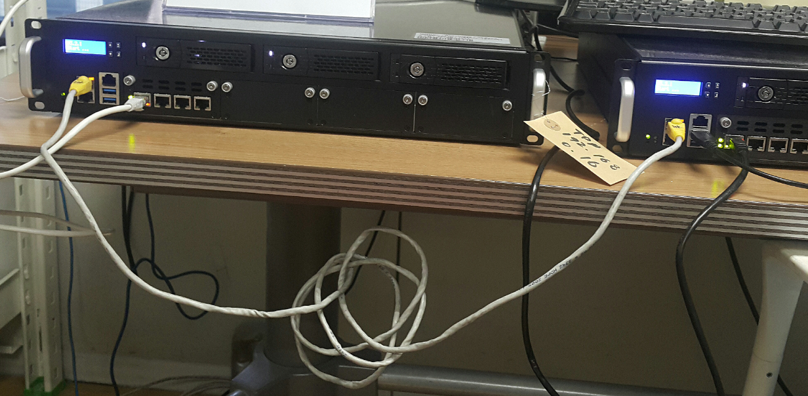

# DRBD 사용하여 DB 이중화 작업 내역

### DRBD

- Distribute Replication Block Device
- 블럭 디바이스를 HA(High Availabilty, 고가용성) 구성을 위한 Network Raid-1(mirroring) 유틸


### 환경
- Ubuntu 18.04
- MariaDB 10.1
- DRBD 8.9


### 장치준비
#### 구성
- 하드웨어 hotlink 연결 


- 두 서버간 파티션 및 drbd 연결 도식화
```
    ┌─────────────────────────┐    ┌────────────────────┐        
    │  /opt/autocrypt/data2   │    │/opt/autocrypt/data1│        
  ┌───────────────────────────┐  ┌──────────────────────┐        
  │                           │  │         ext4         │        
  │            ext4           │──└──────────────────────┐      ┌───────────────────────────┐
  │                           │            drbd         ├──────┤            drbd           │
  ┌───────────────────────────┐─────────────────────────┐      ┌───────────────────────────┐
  │            sdb2           │            sdb1         │      │            sdb1           │ 
┌───────────────────────────────────────────────────────┐    ┌─────────────────────────────┐
│                           HDD                         │    │              HDD            │
└───────────────────────────────────────────────────────┘    └─────────────────────────────┘
                          Server1                                         Server2
```
<hr>

### 작업내역
#### 1. 추가된 하드 자동 마운트 작업 (불필요시 skip)  
1.1. sdb 파티션 구성
```
# fdisk /dev/sdb  
```

1.2. 파티션 포맷
```$xslt
# mkfs.ext4 /dev/sdb1
# mkfs.ext4 /dev/sdb2
```

1.3. 디바이스 UUID 확인 
```$xslt
# blkid
/dev/sdb1: UUID="bf5b50eb-5a00-4dc4-b628-243bea114909" TYPE="ext4" PARTUUID="18c5e0b8-01"
/dev/sdb2: UUID="21d5fe61-691c-44fa-9066-d2365a52d45d" TYPE="ext4" PARTUUID="18c5e0b8-02"
```

1.4. 서버 시작 시 자동 마운트를 위한 UUID 등록 (파티션 포맷 시 UUID가 변경된다)
```$xslt
# vi /etc/fstab
UUID=21d5fe61-691c-44fa-9066-d2365a52d45d /opt/autocrypt/data2    ext4    defaults    0    0
```
1.5. 파티션 마운트 후 서버 재시작
```$xslt
# mount /dev/sdb2 /opt/autocrypt/data2
# reboot
```

1.6. 디스크 정보 확인
```$xslt
# df -h
```

<hr>

#### 2. hotlink 작업
2.1. hot link?   
     데이터나 파일의 변경이 발생하면 관련된 다른 프로그램의 데이터나 파일도 변경되도록 지시하는 연결

2.2 인터페이스 확인
```
ip a
```
 
2.2. hotlink용 네트워크 인터페이스 추가
```$xslt
# vi /etc/netplan/파일명.yaml
```
```$xslt
network:
    ethernets:
        enp0s3:
            dhcp4: true

        # enp0s9  : 테스트 장비 hotlink 네트워크 인터페이스 명
        # address : primary의 경우 addresses 10.1.1.1, secondary의 경우 10.1.1.2
        enp0s9:
            dhcp4: no
            addresses: [10.1.1.1/24]  
            gateway4: 10.1.1.1
    version: 2
```
2.2. 네트워크 적용
```$xslt
# netplan apply
```
<hr/>

#### 3. drbd 작업
- 3.1. drbd 설치
```$xslt
# apt install drbd8-utils
```
***추가 내용 hostname 설정

- 3.2. 설정파일 수정
```$xslt
# vi /etc/drbd.conf
```
```$xslt
global {
        usage-count yes;
}
common {
        startup {
                wfc-timeout 10;
                degr-wfc-timeout 10;
                outdated-wfc-timeout 10;
        }
        syncer {
                rate 100M;
        }
        protocol C;
}
resource r0 {
  net {
    after-sb-0pri discard-least-changes;
    after-sb-1pri discard-secondary;
    after-sb-2pri disconnect;
  }
        on vpki1 {
                device          /dev/drbd0;
                disk            /dev/sdb1; # drbd 대상 디바이스
                address         10.1.1.1:7789;
                meta-disk       internal;
        }
        on vpki2 {
                device          /dev/drbd0;
                disk            /dev/sdb1; # drbd 대상 디바이스
                address         10.1.1.2:7789;
                meta-disk       internal;
        }
}
```
- 3.2. 메타 데이터 생성
```$xslt
# drbdadm create-md r0
```

- 3.3. service 시작
```$xslt
service drbd start
```

- 3.4. Primary 서버 설정 (Primary 서버만 작업)
```$xslt
# drbdadm primary --force r0
```

- 3.5. drbd 파티션 포맷
```$xslt
# mkfs.ext4 /dev/drbd0
```

- 3.6. DBMS 데이터 디렉토리 생성 및 마운트
```$xslt
# mkdir -p /opt/autocrypt/data1
# mount /dev/drbd0 /opt/autocrypt/data1
```

- 3.7. 디스크 정보 확인
```$xslt
df -h
```

- 3.8. drdb 상태 확인
```$xslt
# cat /proc/drbd
또는
# drbd-overview
------------------------------------------------
#연결된 상태
Connected Primary/Secondary UpToDate/UpToDate
#싱크 작업 중 상태
SyncSource Primary/Secondary
#연결 시도중 상태
WFConnection Primary/Unknown
#미연결 상태
StandAlone Primary/Unknown
```

- 3.9. 미 연결 상태일 경우
```$xslt
# drbdadm connect r0
OR
# service drbd restart
```

- 참고 (연결 상태일 경우)
```$xslt
root@vpki1:~# drbd-overview
 0:r0/0  Connected Primary/Secondary UpToDate/UpToDate
-----------------------------------------------------------------------------------
root@vpki1:~# netstat -anp | grep 7789
tcp        0      0 10.1.1.1:40083          10.1.1.2:7789           ESTABLISHED -
tcp        0      0 10.1.1.1:7789           10.1.1.2:49725          ESTABLISHED -
```

<hr/>

#### 4. DB 작업
- 4.1. MariaDB 설치
```$xslt
# apt install mariadb-server
```

- 4.2. 초기 MariaDB 데이터 백업
```$xslt
# mv /var/lib/mysql ~/백업디렉토리/
```

- 4.3. 초기 MriaDB 데이터 /opt/autocrypt/data1 디렉토리로 복사
```$xslt
# cp -rf ~/백업디렉토리/mysql/* /opt/autocrypt/data1/
```

- 4.4. mysql 실행을 위한 링크 생성
```$xslt
# ln -s /opt/autocrypt/data1 /var/lib/mysql
```

- 4.5. mysql 디렉토리 owner 변경
```$xslt
# chown -R mysql:mysql /var/lib/mysql/
```

- 4.6. MariaDB 시작
```$xslt
# service mysql start
```

<hr>

참고url
- https://wlstnans.tistory.com/128  

<hr><hr>
#### 테스트 내용

1. 스플릿 브레인(Split Brain) 현상  
: 일반적으로 클러스터로 구성된 두 시스템 그룹간 네트워크의 일시적 동시 단절현상이 발생 시 나타나는 현상.
 클러스터 상의 모든 노드들은 노드 각자가 자신을 primary라고 인식하게 되는 상황을 말한다.

테스트:
```
 primary : drbdadm down r0  
 secondary: drbdadm primary --force r0  
 primary : drbdadm up r0  
  => Occur split brain  
```
 해결: 
 ```
 # drbdadm create-md r0  
 # drbdadm up r0  
 # drbdadm connect r0  
 # service drbd start  
```
  
<hr>

#### 모니터링 
##### 1. primary   
 monitoring target : was / db  
 문제 발생 시 :   
	 - 1. stop was / db / drbd  
	 - 2. ?
##### 2. secondary
 monitoring target : drbd-overview or /proc/drbd   
 check point :
```
# drbd-overview
0:r0/0  *Connected* Secondary/Primary UpToDate/UpToDate
---------------------------------------------------------
** 문제 발생 시 : status is not 'Connected'
``` 
  
<hr>

##### 스크립트 시나리오  
 -. secondary에서 primary로 변경
```
 # drbdadm primary --force r0
```   
 -. check changed state
```
 # drbd-overview
```
 -. mount device
```
 # mount /dev/drbd0 /opt/autocrypt/data1
```
 -. check mounted state
```
# df -h
``` 
 -. service start : DB, WAS, Primary Script?

 -. Secondary Script exit
