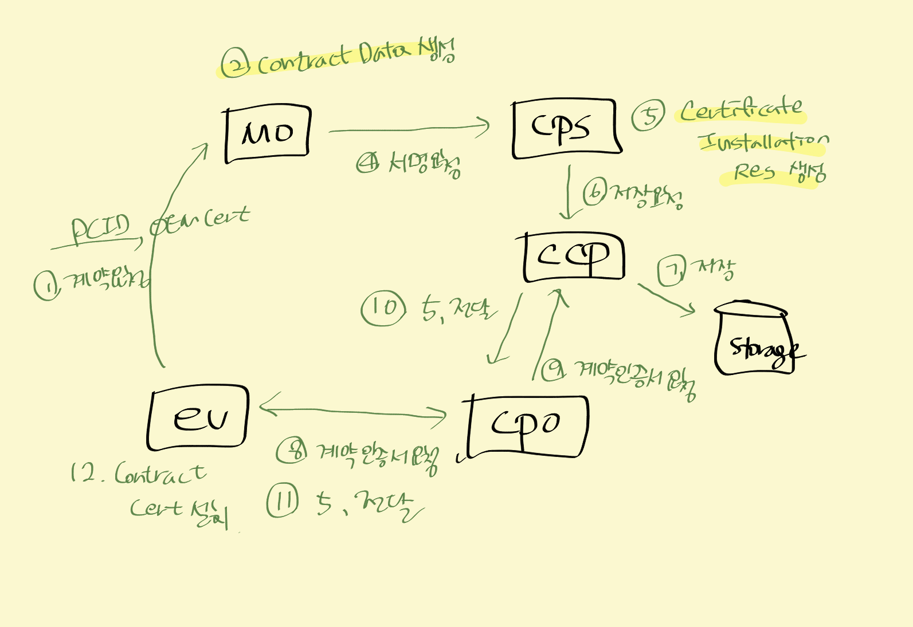

### [ Error & Solv ]

#### #1. signature marshalling error
- 에러 메시지
```
[com.sun.istack.internal.SAXException2:
     @XmlRootElement 주석이 누락되어 "com.autocrypt.v2g.common.message.type.SignatureType" 유형을 요소로 마셜링할 수 없습니다.]
```  

- 원인
```
// 작업 시 , SignatureType에 @XmlRootElement 누락
val signatureByteArray = MsgDigest.generateXMLToByteArray(signature, SignatureType::class.java)?: return null
```

- 해결
```
// SignatureType에 anotation 추가
@XmlRootElement(name = "Signature", namespace = "http://www.w3.org/2000/09/xmldsig#")
```


#### #2. grammarMsgDef로 EXI Encoding 후 Decoding 시 메시지가 짤려서 나오는 현상
- 원인  
  certChain의 namespace 잘못됨

- 해결
```
msgBody에서 MsgDataTypes 로 변경
```
