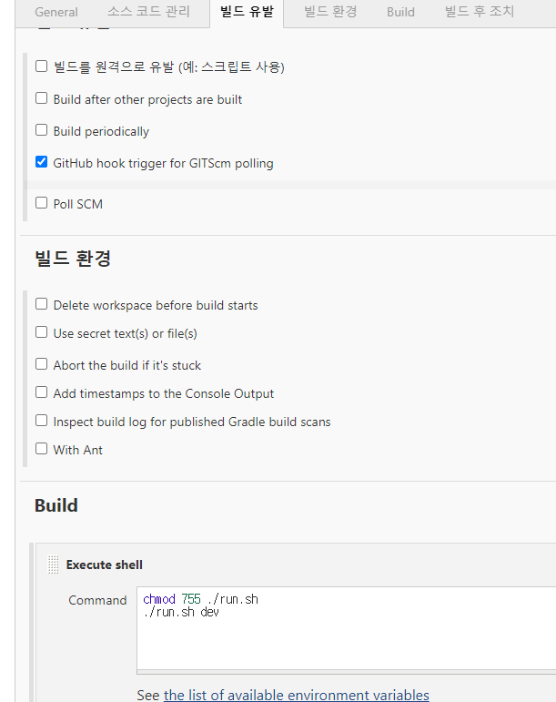

jenkins에서 github hook trigger 발생 후에 
빌드 단계에서 실행 되는 스크립트를 작성하였다.

 

한 서버에 dev/ prod 두개의 서비스가 다 올라가야해서 스크립트 실행 시 parameter를 받는 방식으로 진행하였다.

if문 작성이 왜이리 오래 걸렸는지...
관련 내용을 기록 좀 해두고 써먹어야겠다. 

### 작성내용
```
#!/bin/bash

cd frontend
npm install
npm run build
cd ..

gradle build
gradle bootjar
if [ "$1" == "dev" ]; then
        PORT=15000
elif [ "$1" == "prod" ]; then
        PORT=15118
else
        echo bad parameter
        exit 1
fi

PID=`ps -ef | grep V2G | grep ${PORT} | grep -v grep | awk '{print $2}'`
PID_LENGTH=${#PID}
if [ ${PID_LENGTH} -gt 0 ]
then
        kill $PID
fi

BUILD_ID=dontKillMe nohup java -jar -Duser.timezone=Asia/Seoul ./build/libs/AutoCrypt-V2G-0.0.1-SNAPSHOT.jar --server.port=${PORT} --spring.profiles.active=$1,swagger >> ./logs/server.log &

```

### 참고 내용
* 문자열 길이 구하기
```
${#PID}
```

* 변수의 값을 참조할때는 ${변수이름} 처럼 중괄호로 감싸주는 습관을 들이면 좋다.
* if 문 사용법
```
FILENAME="/home/test/temp"
VALUE=10
if [ ${VALUE} -eq 10 ] ; then
	echo "VALUE is 10!"
fi
# 아래 -a (&&) 조건문은 아래와 같이 변경 가능합니다.
# if [ ${VALUE} -gt 5 ] && [ ${VALUE} -lt 15 ] ; then
if [ ${VALUE} -gt 5 -a ${VALUE} -lt 15 ] ; then
	echo "VALUE is greater than 5 and less than 15!"
fi
if [ -e ${FILENAME} ] ; then
	echo "${FILENAME} exists"
fi
```

* 조건문 종류
```
비교식
[ -z ${A} ] : A 문자열의 길이가 0이면 TRUE
[ -n ${A} ] : A 문자열의 길이가 0이 아니면 TRUE
[ ${A} -eq ${B} ] : A와 B값이 같으면 TRUE
[ ${A} -ne ${B} ] : A와 B값이 다르면 TRUE
[ ${A} -gt ${B} ] : A가 B보다 크면 TRUE
[ ${A} -ge ${B} ] : A가 B보다 크거나 같으면 TRUE
[ ${A} -lt ${B} ] : A가 B보다 작으면 TRUE
[ ${A} -le ${B} ] : A가 B보다 작거나 같으면 TRUE
--
[ 조건식A -a 조건식B ] : 조건식 A와 B가 모두 TRUE이면 TRUE (&& 와 동일)
[ 조건식A -o 조건식B ] : 조건식 A가 TRUE거나 조건식B가 TRUE면 TRUE (|| 와 동일)
--
파일관련
[ -d ${A} ] : A 파일이 디렉토리면 TRUE
[ -e ${A} ] : A 파일이(노드, 디렉토리, 소켓 등등 모두) 존재하면 TRUE
[ -L ${A} ] : A 파일이 심볼릭 링크면 TRUE
[ -r ${A} ] : A 파일이 읽기 가능하면 TRUE
[ -s ${A} ] : A 파일의 크기가 0 보다 크면 TRUE
[ -w ${A} ] : A 파일이 쓰기 가능하면 TRUE
[ -x ${A} ] : A 파일이 실행 가능하면 TRUE
[ -c ${A} ] : A 파일이 Special character file 이면 TRUE
[ -f ${A} ] : A 파일이 디렉토리가 아닌 일반 regular 파일이면 TRUE
[ -S ${A} ] : A 파일이 소켓이면 TRUE
[ ${A} -nt ${B} ] : A 파일 B 파일보다 최신파일이면 참
[ ${A} -ot ${B} ]  : A 파일이 B 파일보다 이전파일이면 참
[ ${A} -ef ${B} ] : A 파일과 B 파일이 같은 파일이면 참
```

* 비교식 옵션 설명
```
-eq : EQual
-ne : NEgative
-gt : Greater Than
-ge : Greater than Equal
-lt : Less Than
-le : Less than Equal
-d : Directory
-e : Exist
-L : symbolic Link
-r : Readable
-w : Writeable
-x : eXecute
-nt : Newer Than
-ot : Older Than
-ef : Equal File
```

##### 참고 사이트 
* [문자열 길이 구하기](https://louky0714.tistory.com/entry/BASH-Shell-%EB%AC%B8%EC%9E%90%EC%97%B4-%EA%B8%B8%EC%9D%B4-%EA%B5%AC%ED%95%98%EA%B8%B0)
  


