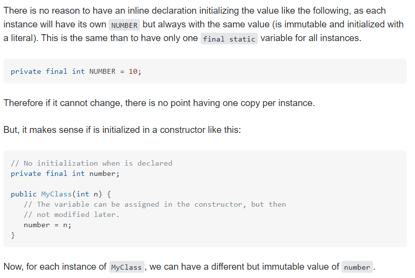

서비스 클래스에서 constant 로 사용하기 위해 아래와 같이 변수를 선언했다
```
 private final List<String> ALPA_LIST = Arrays.asList("a", "b", "c")
```
접근제어자가 private 이고, 하나의 controller 에만 주입되어 사용하고 있어
static 키워드 없이 사용하였는데,  
해당 변수에 대한 사용의도(private final이 constant로 적합한가?)에 대해 얘기를 하게 되었고
아래와 같은 의문을 갖게 되었다.

### 1. static vs final
#### static 
means there is only <strong>one copy of the variable in memory</strong> shared by all instances of the class.

#### final
The final keyword just means the value <strong>can't be changed.</strong> Without final, any object can change the value of the variable.

### 2. private final vs private final static
 


<hr>

결론은...  
constant 로서 사용되는 변수는
 - 모든 인스턴스에서 동일한 값을 사용하고,  
 - 새로 메모리를 잡을 필요가 없고
 - 초기화 후에 immutable 한 값이므로
static 키워드를 추가하여 사용한다.
```
 private final static List<String> ALPA_LIST = Arrays.asList("a", "b", "c")
```

<hr>

#### [ 200914 추가내용 ]
```
Arrays.asList()
# remove(), add()를 지원하지 않음. 사용시 java.lang.UnsupportedOperationException 발생
# ArrayList와 마찬가지로 set(), get(), contains() 제공
```
즉 value가 변할 수 있는 객체이므로, 상수로서 적합하지 않다.
따라서 immutable 하도록 아래와 같이 사용한다.
```
 private final static List<String> ALPA_LIST = Collections.unmodifiableList(Arrays.asList("a", "b", "c"))
``` 

Java 9부터는 List <E> .of (E… elements) 정적 팩토리 메서드를 사용
```
@Test(expected = UnsupportedOperationException.class)
public final void givenUsingTheJava9_whenUnmodifiableListIsCreated_thenNotModifiable() {
    final List<String> list = new ArrayList<>(Arrays.asList("one", "two", "three"));
    final List<String> unmodifiableList = List.of(list.toArray(new String[]{}));
    unmodifiableList.add("four");
```

#### 참고
- https://djkeh.github.io/articles/Why-should-final-member-variables-be-conventionally-static-in-Java-kor/
- https://stackoverflow.com/questions/1415955/private-final-static-attribute-vs-private-final-attribute
- https://stackoverflow.com/questions/13772827/difference-between-static-and-final
