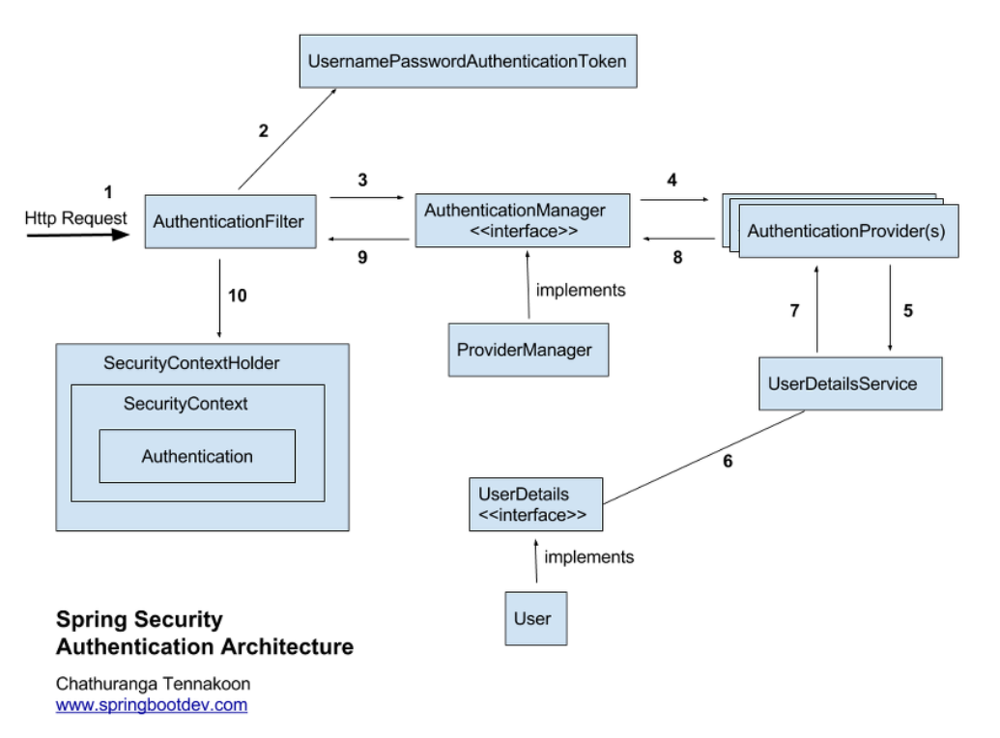
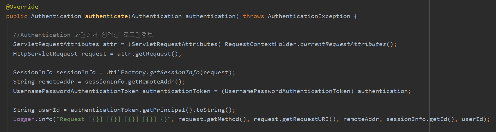
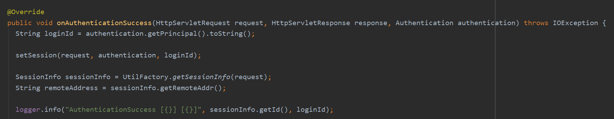
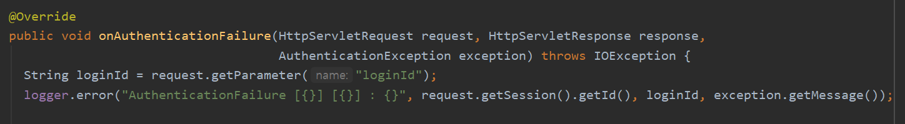
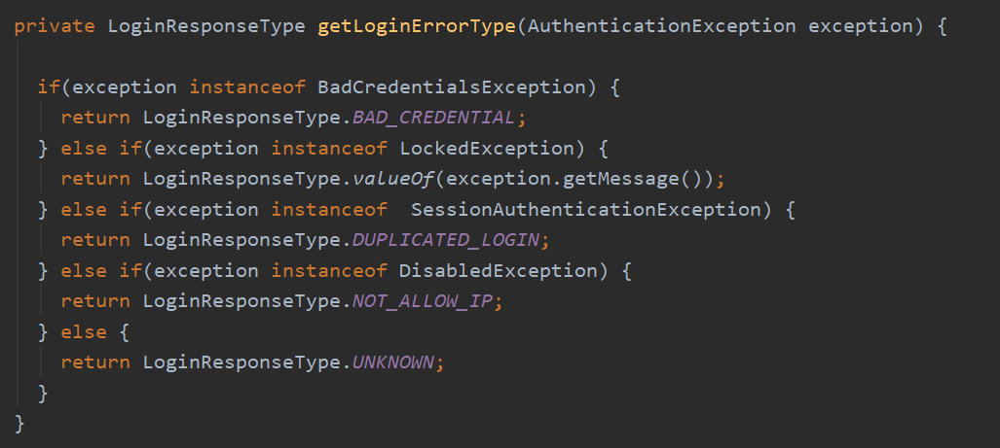

모든 req/res DB 로깅은 interceptor 에서 진행하였고,  
로그인/ 로그아웃에 대한 req/res 로깅은 AuthenticationProvider 클래스를 구현한 곳에서 로깅을 하였는데,
로그인 로그아웃에 대한 로깅 위치에 대한 의문을 가지게 되었다.  

### #. Spring Security 구조

### #. 구현내용
- AuthenticationProvider 의 구현체에서 authenticate() 메소드를 Override 받아 로그인 확인 로직을 구현하였다.  
- req 데이터에 대한 로깅은 여기서 진행

- 로그인이 성공 할 경우 onAuthenticationSuccess() 를 재정의하여 res 데이터에 대한 로깅을 진행

- 로그인이 실패 할 경우 onAuthenticationFailure() 를 재정의하여 exception에 대한 로깅을 진행

- AuthenticationException 에 대한 메시지 처리

### #. AuthenticationException
- UsernameNotFoundException : 계정 없음
- BadCredentialsException : 비밀번호 불일치
- SessionAuthenticationException : Invalid 한 세션
- AccountStatusException  
 -- AccountExpiredException : 계정만료  
 -- CredentialsExpiredException : 비밀번호 만료  
 -- DisabledException : 계정 비활성화  
 -- LockedException : 계정잠기  

##### 참고
* https://sjh836.tistory.com/165
* https://docs.spring.io/spring-security/site/docs/3.1.x/apidocs/org/springframework/security/core/AuthenticationException.html
