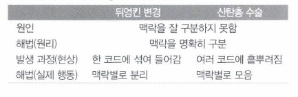

#Chapter3. 코드에서 나는 악취

리펙토링 기법: 패턴을 찾자.

### 1. 기이한 이름(Mysterious Name)  
 - 코드를 명료하게 표현하는 데 가장 중요하나 요소 하나는 바로 '이름'이다.
 - 그래서 함수, 모듈, 변수, 클래스 등은 그 이름만 보고도 각각이 무슨 일을 하고 어떻게 사용해야 하는지 명확히 알 수 있도록 이름을 지어야 한다.
 - 마땅히 떠오르지 않는다면 설계에 근본적인 문제가 있다.

### 2. 중복 코드(Duplicated Code)
 - 중복된 코드는 하나로 통합하자.  
   -- 함수 추출하기, 상속 사용하기 
 
 
### 3. 긴 함수 (Long Function)
 - 긴 함수는 이해하기 어렵다.  
   -- 주석을 달아야 할 부분은 무조건 함수로 만든다

 - 이해하기 쉬운 짧은 함수의 조건은 이름이다.  
   -- 함수 이름을 잘 지으면 본문 코드를 볼 이유가 사라진다.  
   -- 함수의 이름은 동작 방식이 아닌 의도 또는 목적이 드러나게 짓는다.  

 - 조건문/ 반복문  
   -- 뒷부분에 계속  

### 4. 긴 매개변수 목록(Long Parameter List)
 - 매개변수 객체 만들기  
 - 여러 개의 함수가 특정 매개변수들의 값을 공통으로 사용할 때 클래스를 정의하여 공통 값을들 클래스의 필드로 정의 후 사용한다??    
   <>이건 아닌듯 싶다.. 목적이 있는 클래스에 맞는 함수들을 멤버화 시키는게 맞다고 생각한다.</>
 
 
### 5. 전역 데이터(Global Data)
 - 클래스 변수, 싱글톤
 - 코드베이스 어디에서든 수정이 가능하기에 버그 발생 요소가 높다.
 - 변수 캡슐화  
   -- 변수 캡슐화가 의미가 있을까??  
      전역 데이터는 되도록 상수화를 사용하도록 하며, 가변 데이터일 경우 접근제어를 사용하는게 낫지 않을까 싶다.
   
   
### 6. 가변 데이터(Mutable Data)
 - 원본 데이터는 그대로 둔 채 변경하려는 값에 해당하는 복사본을 만들어 반환한다. (참조를 값으로 바꾼다)
 - 데이터에 대한 갱신 로직은 따로 정의를 하는게 좋다.
 
 
### 7/8. 뒤엉킨 변경(Divergent Change) vs 산탄총 수술(Shotgun Surgery)

  * 뒤엉킨 변경 - 함께 변경 할 대상을 한데 모으는 것
   -- 전략패턴, 방문자 패턴, 켄트 벡의 자기 위임
  * 산탄총 수술 - JPA wrapper 도입 고민 필요
  
  
### 9. 기능 편애(Feature Envy)
 - 정의된 목적에 해당하는 기능이 수행되도록 함수/클래스를 정의한다.
 - 기능편애를 거스르는? 이라기보단 좀 더 advanced 예제 : 전략 패턴, 방문자 패턴, 켄트 백의 자기 위임
 
 
### 10. 데이터 뭉치(Data Clumps)
 - 데이터 뭉치는 클래스화

### 11. 기본형 집착(Primitive Obsession)
 - 전화번호 같은 문자열화된 변수(stringly type)를 객체로 바꾸어 사용하자
 - 조건부 동작을 제어하는 타입 코드로 쓰였다면 다형성을 적용하자  
  -- 서브 클래스 적용 및 조건부 로직에 다형성 적용?? <strong>글쎄.. 뒤에서 다시 다루자</strong>

### 12. 반복되는 switch 문(Repeated Switches)
 - 반복되고 중복된 조건부 로직에 대해 다형성 도입  
  -- 조건절을 추가할 때마다 수정해야 할 부분이 여러 곳이면 안된다.

### 13. 반복문(Loop)
 - 반복문을 파이프라인으로 바꾸기  
  -- filter, map 같은 파이프라인 연산을 사용하면 코드에서 각 원소들이 어떻게 처리되는지 쉽게 파알할 수 있다.
  
### 14. 성의 없는 요소(Lazy Element)
 - 역할이 거의 없는 클래스 또는 함수는 제거하자
 
 
### 15. 추측성 일반화(Speculative Generality)
 - 미래를 대비해 작성한 후킹포인트와 특이 케이스 처리 로직은 불필요하다.  
  -- 후킹포인트: 함수 호출, 메시지, 이벤트 등을 중간에서 바꾸거나 가로채는 명령, 방법 기술이나 행위

### 16. 임시 필드(Temporary Field)
 - 특정 상황에서만 값이 설정되는 필드들은 따로 클래스화 한다.
  -- 클래스 목적에 의해 정의된 필드들을 다시 세분화 한다?  
     필드가 많을 경우 그렇다고 하지만, nullable한 필드를 위한 세분화는 글쎄..
     차라리 nullable로 필드를 정의하여 assertion 하는게 낫지 않을까?
     해당 부분은 정말 특이 케이스라 생각한다
 
 
### 17. 메시지 체인(Message Chains)
 - 클라이언트가 객체 내비게이션 구조에 종속됐음을 의마한다.
   (다른 객체를 요청하는 작업이 연쇄적으로 이어지는 코드)
 - 최종 결과 객체가 어떻게 쓰이는지 확인 후 체인을 숨기는 방법을 고민하자
 
 
### 18. 중개자(Middle Man)
 - 위임이 지나치면 문제가 된다.
 - 케이스에 따라 위임 메서드를 제거하여 실제로 일을 하는 객체와 직접 소통하게 하자(중개자 제거)
 
 
### 19. 내부자 거래(Insider Trading)
 - 모듈간 결합도를 낮추기 위해 함수 또는 클래스를 세분화 한다. 
 
 
### 20. 거대한 클래스(Large Class)
 - 필드가 많으면 중복 코드가 생기기 쉽다
 - 상속 또는 서브클래스를 사용하여 분할하자. 
 
 
### 21. 서로 다은 인터페이스의 대안 클래스들(Alternative Classes with Different Interface)
 - 인터페이스 또는 상속을 이용한 설계를 고민하자
 
 
### 22. 데이터 클래스(Data Class)
 - 데이터 필드와 개터/세터 만으로 구성된 클래스
 - immutable 한 필드는 세터를 제거하자.
 - 로직 단위를 쪼개 중간 결과 데이터의 구조(클래스)는 불변이다.  
    불변 필드는 굳이 캡슐화 할 필요가 없다?? Object 구조 일 경우 값이 변경될 수 있으므로 getter 는 사용하는게 나을거 같다.

### 23. 상속 포기(Refused Bequest)
 - 일부 동작을 재활용하기 위한 목적으로 상속을 사용한다. (실무 관점에서 아주 유용하다에 동의)
 - 인터페이스를 따르지 않는 경우 서브 클래스 생성 또는 ????????

### 24. 주석(Comments)
 - 주석이 필요한 부분에 함수를 추출하여 이름을 잘짓자.
 - 선행조건을 명시하고 싶다면 어서션을 추가하자.
