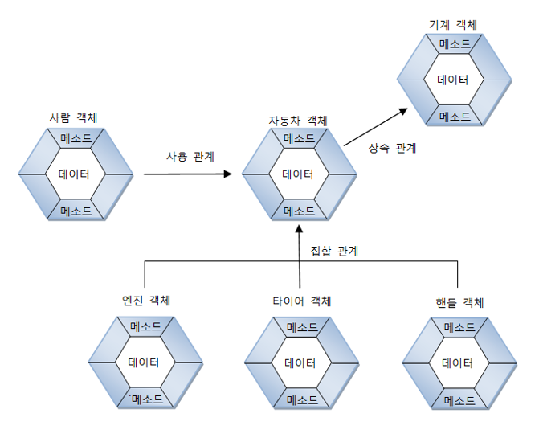
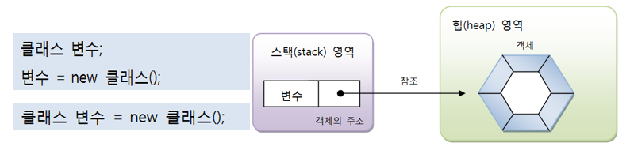
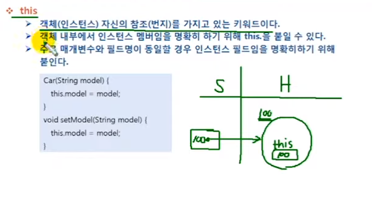
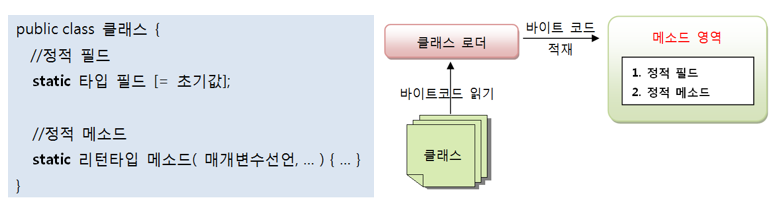

## 객체(Object) 란?
- 자신의 속성과 동작을 가진 모든 것
- 객체 vs 인스턴스  
 -- 객체는 선언을 의미
 -- 인스턴스는 연산자를 통해 클래스로부터 실체화가 됨을 의미
```
class Car { ... }
Car tico, morning, matiz; // 객체
tico = new Car(); // 인스턴스
```
##### 참고
https://dbnsecu.tistory.com/8  
https://gmlwjd9405.github.io/2018/09/17/class-object-instance.html

## 객체간의 관계
#### 관계의 종류
- 집합 관계: 완성품과 부품의 관계
- 사용 관계: 객체가 다른 객체를 사용하는 관계
- 상속 관계: 종류 객체와  구체적인 사물 객체 관계


## 클래스 변수
- new 연산자에 의해 리턴 된 객체의 번지 저장 (참조 타입 변수)
- 힙 영역의 객체를 사용하기 위해 사용


## 인스턴스 멤버
- 인스턴스 생성 시 아래와 같은 메모리 구조를 갖는다.


#### this 키워드
- 인스턴스 자신의 주소를 가지고 있는 키워드



## 정적 멤버와 static
#### 정적(static) 멤버란?
- 클래스에 고정된 필드와 메소드 - 정적 필드, 정적 메소드
- 정적 멤버는 클래스에 소속된 멤버  
  -- 객체 내부에 존재하지 않고, 메소드 영역에 존재  
  -- 정적 멤버는 객체를 생성하지 않고 클래스로 바로 접근해 사용


#### 정적 초기화 블록
- 클래스가 메소드 영역으로 로딩될 때 자동으로 실행하는 블록
- 정적 필드 초기화 및 정적 메소드 호출 가능
- 인스턴스 멤버나 메소드 호출 불가능
```
static {
    ...
}
```

#### Annotation


