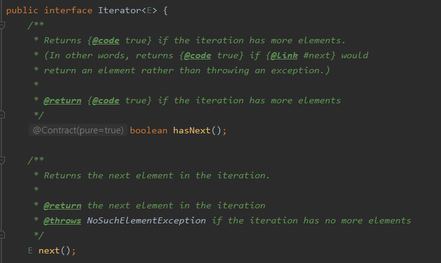

## 아이템69) 예외는 진짜 예외 상황에만 사용하라
예외는 예외 상황에서 쓸 의도로 설계되었다.  
정상적인 제어 프름에서 사용해서는 안되며, 이를 프로그래머에게 강요하는 API를 만들어서도 안된다.

### 예외는 일상적인 제어 흐름용으로 쓰여선 안된다.
Good 코드와 같은 표준적이고 쉽게 이해되는 관용구를 사용해라
```java
//Bad
try {
  int i=0;
  while(true)
    range[i++].climb();
} catch(ArrayIndexOutOfBoundsException e) {
}

//Good
for (Mountain m : range)
    m.climb();
```

### 정상적인 제어 흐름에서 예외를 사용할 일이 없어야 한다.
특정 상태에서만 호출할 수 있는 '상태 의존적' 메서드를 제공하는 클래스는 '상태 검사' 메서드도 함께 제공해야 한다. 
- '상태 의존적' 메서드 : Iterator의 next()
- '상태 검사' 메서드 : Iterator의 hasNext()



#### 상태 검사 메서드 대신 사용할 수 있는 선택지
 - Optional, 특정 값(null)
---계속
