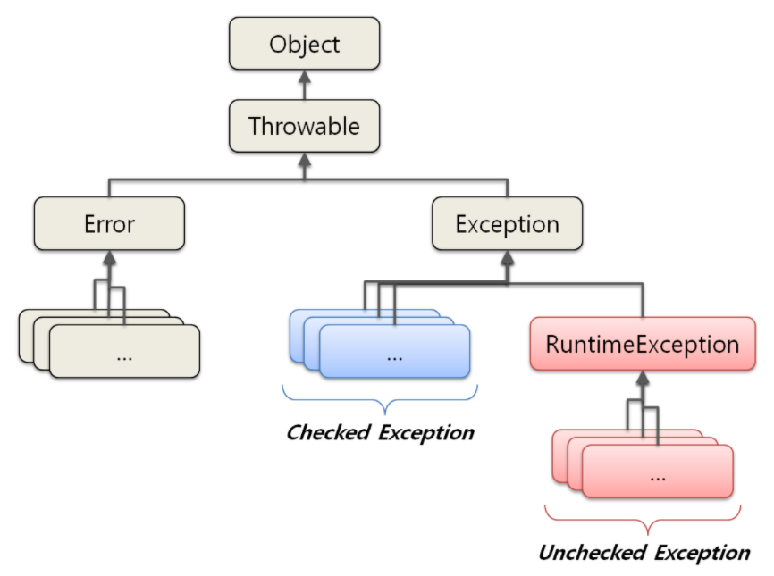
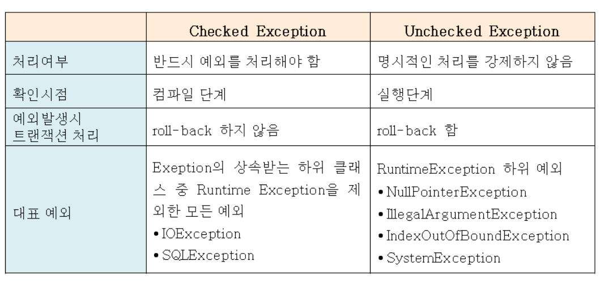
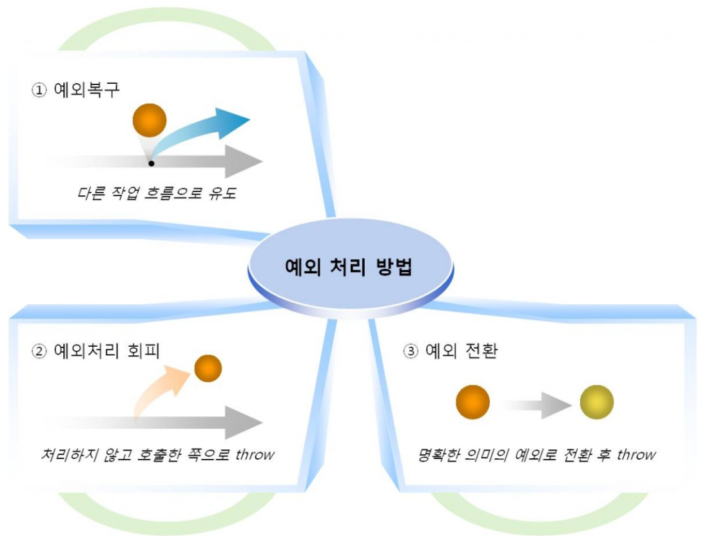

## 아이템70) 복구할 수 있는 상황에는 검사 예외를, 프로그래밍 오류에는 런타임 예외를 사용하라
복구할 수 있는 상황이면 Checked Exception, 프로그래밍 오류거나 확실하지 않다면 Runtime Exception 을 예외로 던지자.  
  
### Exception vs Error
오류(Error)는 시스템에 비정상적인 상황이 생겼을 때 발생한다(JVM 자원 부족 등).  
이는 시스템 레벨에서 발생하기 때문에 심각한 수준의 오류이다.   
따라서 개발자가 미리 예측하여 처리할 수 없기 때문에, 애플리케이션에서 오류에 대한 처리를 신경 쓰지 않아도 된다.

오류가 시스템 레벨에서 발생한다면, 예외(Exception)는 개발자가 구현한 로직에서 발생한다.  
즉, 예외는 발생할 상황을 미리 예측하여 처리할 수 있다.  
즉, 예외는 개발자가 처리할 수 있기 때문에 예외를 구분하고 그에 따른 처리 방법을 명확히 알고 적용하는 것이 중요하다.

### Exception
예외 클래스 구조
- 모든 예외클래스는 Throwable 클래스를 상속받고 있다
- Error는 시스템 레벨의 심각한 수준의 에러이기 때문에 시스템에 변화를 주어 문제를 처리해야 하는 경우가 일반적이다.
- Exception은 개발자가 로직을 추가하여 처리한다.
- RuntimeException은 CheckedException과 UncheckedException을 구분하는 기준


#### Checked Exception VS Unchecked(Runtime) Exception
- 가장 명확한 구분 기준은 ‘꼭 처리를 해야 하느냐’이다.
- Checked Exception이 발생할 가능성이 있는 메소드라면 반드시 로직을 try/catch로 감싸거나 throw로 던져서 처리해야 한다.
- Unchecked Exception은 명시적인 예외처리를 하지 않아도 된다. 


```java
//Before
public void method() throws Exception {
  throw RuntimeException();
}

//After
public void method() {
  throw RuntimeException();
}
```

#### 예외 처리 방법

- 1.예외 복구  
예외복구의 핵심은 예외가 발생하여도 애플리케이션은 정상적인 흐름으로 진행된다는 것이다.

```java
int maxretry = MAX_RETRY;  
while(maxretry -- > 0) {  
    try {
        // 예외가 발생할 가능성이 있는 시도
        return; // 작업성공시 리턴
    }
    catch (SomeException e) {
        // 로그 출력. 정해진 시간만큼 대기
    } 
    finally {
        // 리소스 반납 및 정리 작업
    }
}
throw new RetryFailedException(); // 최대 재시도 횟수를 넘기면 직접 예외 발생  
```

- 2.예외처리 회피     
호출한 쪽에서 다시 예외를 받아 처리하도록 하거나, 해당 메소드에서 이 예외를 던지는 것이 최선의 방법이라는 확신이 있을 때만 사용해야 한다.

```java
public void add() throws SQLException {  
    ... // 구현 로직
}
```

- 3.예외 전환  
호출한 쪽에서 예외를 받아서 처리할 때 좀 더 명확하게 인지할 수 있도록 돕기 위한 방법이다.  
어떤 예외인지 분명해야 처리가 수월해지기 때문이다.  
예를 들어 Checked Exception 중 복구가 불가능한 예외가 잡혔다면 이를 Unchecked Exception으로 전환하여서 다른 계층에서 일일이 예외를 선언할 필요가 없도록 할 수도 있다.
 
```java
catch(SQLException e) {  
   ...
   throw DuplicateUserIdException();
}
```
