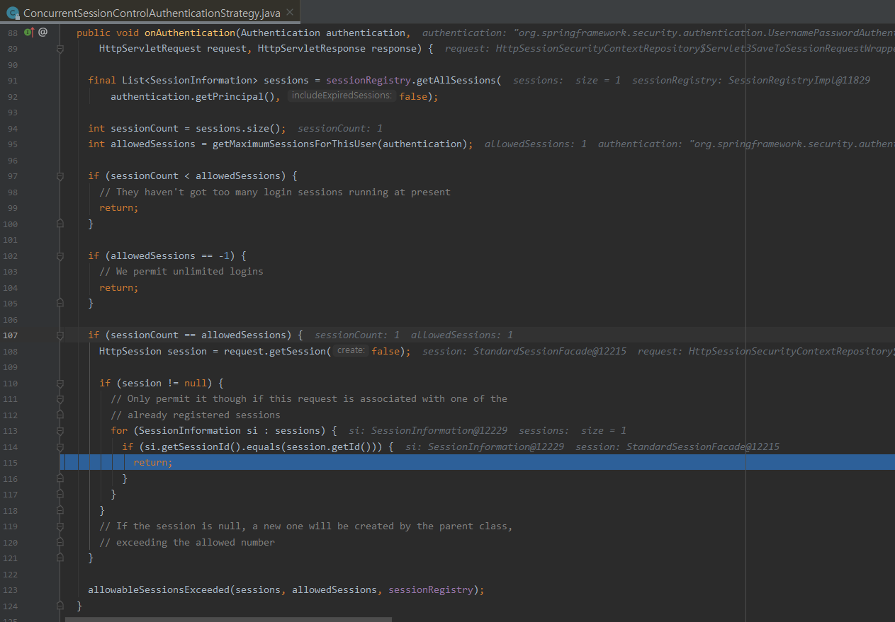
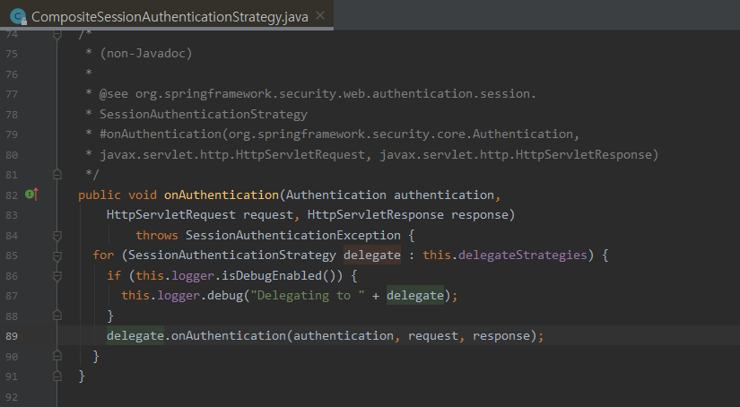
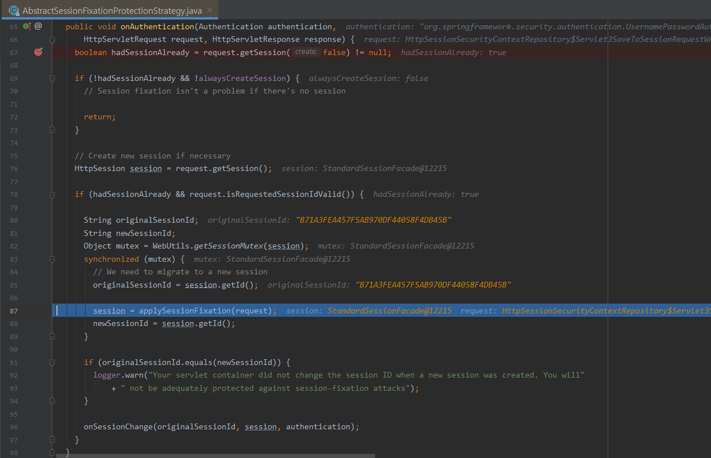
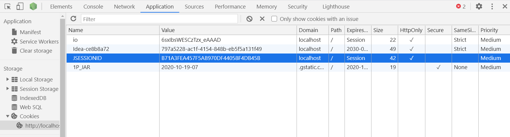
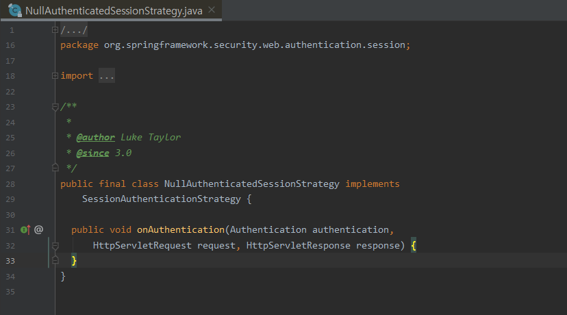

### 의문사항
- 같은 Session 에서 중복 로그인이 가능하다.
- 같은 Session 에서 중복 로그인 시 session id가 변경된다.
- 로그아웃 후에 다시 로그인을 하면 '이미 접속된 아이디' 오류가 난다.
- session 사용시 cookie 에 저장되는 JSESSIONID 에 대한 보안 이슈가 없는가


#### 1. session 설정 내용
 - maximumSessions : 최대 세션 개수
 - maxSessionsPreventsLogin : 기존에 접속한 사용자가 있을 경우 기존 사용자의 접속을 끊고, 나중에 접속한 사용자가 접속되도록 한다.(default: false)
 
```java
@EnableWebSecurity
public class SecurityConfig extends WebSecurityConfigurerAdapter {
    @Override
      protected void configure(HttpSecurity http) throws Exception {
        http.sessionManagement()
          .maximumSessions(1)
          .maxSessionsPreventsLogin(true)
          .sessionRegistry(sessionRegistry())
        ;
    }
}
```

#### 2. DEBUG 

chrome 에서 admin 계정으로 로그인 후(SessionId를 부여 받음) 새탭에서 다시 admin 계정으로 로그인을 하면 



동일한 SessionId 에서 로그인 시도를 했기 때문에  
ConcurrentSessionControlAuthenticationStrategy.onAuthentication() 에서
123라인의 allowableSessionsExceeded() 메소드(중복로그인 exception)를 호출하지 않고 종료가 된다.



CompositeSessionAuthenticationStrategy.onAuthentication() 에서
fixation 기본값 인 migrateSession에 의해 AbstractSessionFixationProtectionStrategy 가 delegate 된다. (89라인)



AbstractSessionFixationProtectionStrategy.onAuthentication() 에서
Session Fixation Attack 방지로 인해 NewSessionId가 생성된다.  
즉, 동일 로그인ID 'admin' 으로 SessionId, NewSessionId 각 2개가 생성되었다.  



탬 1, 탭2 의 브라우저 cookie 에는 마지막으로 생성된 NewSessionId가 부여되며, 기존 SessionId를 해제를 하지 못한 상태로 Client 에서 사라지게 된다.  
즉, NewSessionId로 로그아웃을 하더라도 'admin' 계정에 대한 SessionId가 존재하므로 재 로그인 시 중복된 로그인 에러가 뜨게 된다.


#### 3. 해결방안 : sessionFixation - none
- Session Fixation Attack 방지  
악의적인 사용자가 사이트에 접근하기 위한 세션을 만들고, 그 세션을 통해 다른 사용자로 로그인 하려고 하는 경우(예를 들어, 세션에 ID를 파라미터로 포함하여 전송하는 경우) 
Session fixation attack의 잠재적인 위험이 존재하게 된다.  
스프링 시큐리티는 이러한 공격을 자동으로 막기 위하여 사용자 로그인 때마다 새로운 세션을 생성한다.   
이러한 방지 기능이 필요하지 않거나, 다른 기능들과 충돌이 발생할 경우에는, <session-management>의 session-fixation-protection 속성값으로 동작을 제어할 수 있다.    
속성은 다음과 같은 세가지 옵션값들을 가진다.  

- 동일 세션에서 로그인이 재발생해도 동일한 session id를 갖도록 한다.
- 동일 세션에서 중복 로그인 후 로그아웃하면 해당 로그인 id에 대한 세션이 해제가 되어 재 로그인이 가능하다.
- none 으로 설정 시 호출되는 Session Strategy Class

 
 
```java
// migrateSession : 새로운 세션을 생성하고 기존의 세션 값들을 새 세션에 복사해준다. 기본값으로 설정되어 있다.
// none : 아무것도 수행하지 않는다. 원래의 세션이 유지된다.
// newSession : "깨끗한" 새로운 세션을 생성한다. 기존의 세션데이터는 복사하지 않는다.

http.sessionManagement()
  .sessionFixation().none()
  .maximumSessions(1)
  .maxSessionsPreventsLogin(true)
  .sessionRegistry(sessionRegistry())
```

#### 4. JSESSIONID 는 안전한가?
- 기본적으로 HttpOnly 를 사용   
- HttpOnly는 Set-Cookie HTTP 응답 헤더에 포함 된 추가 플래그   
- 쿠키를 생성 할 때 HttpOnly 플래그를 사용하면 보호 된 쿠키에 액세스하는 클라이언트 측 스크립트의 위험을 완화하는 데 도움이됩니다
- XSS ( 교차 사이트 스크립팅 ) 결함이 존재하고 사용자가이 결함을 악용하는 링크에 실수로 액세스하더라도 브라우저 (주로 Internet Explorer)는 쿠키를 제 3 자에게 공개하지 않는다.
