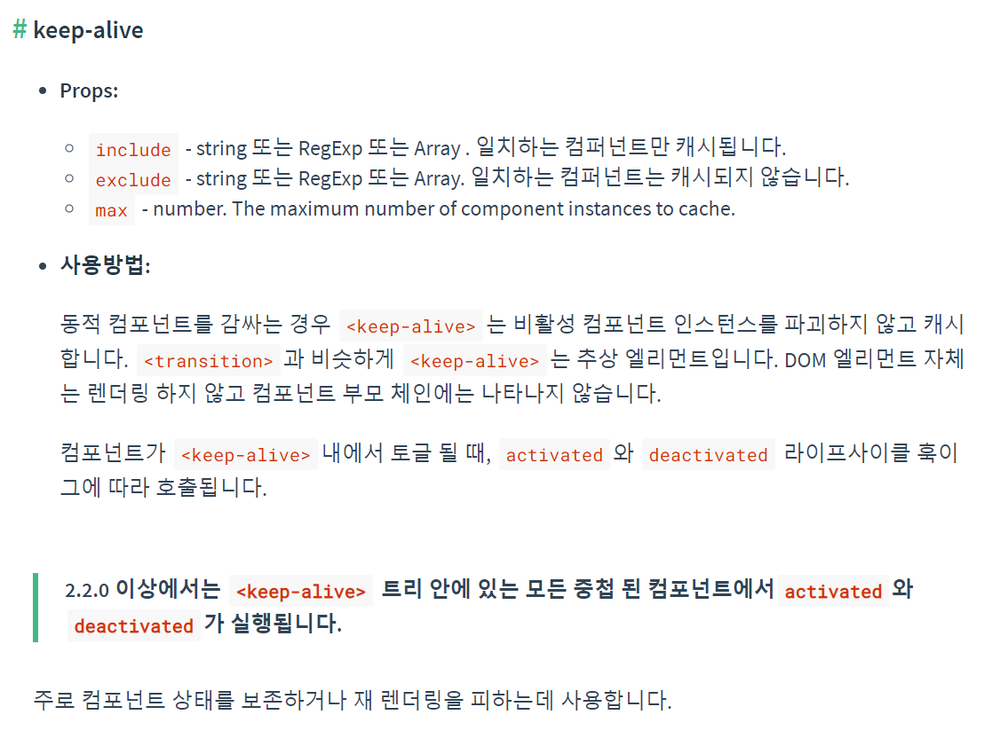

## keep-alive

* keep-alive 는 비활성 컴포넌트 인스턴스를 파괴하지 않고 캐시한다.
* keep-alive 를 사용하면 컴포넌트 인스턴스가 전역 큐에 저장되고, 활성화 될 때는 기존 컴포넌트를 사용하여 activated 라이프 사이클 hook이 호출되며, 비활성화시에는 인스턴스를 소멸시키지 않고 deactivated 라이프사이클 hook이 호출된다.

* ref) https://learnvue.co/2019/12/an-overview-of-vue-keep-alive/
       https://velog.io/@kyusung/VUE-keep-alive

## destroy component cash
```javascript
clearComponentCache: (param) => {
    const component = param.matched[0].instances.default;

    if (component && component.$vnode && component.$vnode.data.keepAlive) {
      if (component.$vnode.parent && component.$vnode.parent.componentInstance && component.$vnode.parent.componentInstance.cache) {
        if (component.$vnode.componentOptions) {
          const key = component.$vnode.key ? 
            component.$vnode.key :
            component.$vnode.componentOptions.Ctor.cid + (component.$vnode.componentOptions.tag ? `::${component.$vnode.componentOptions.tag}` : '');
          const cache = component.$vnode.parent.componentInstance.cache;
          const keys = component.$vnode.parent.componentInstance.keys;
          if (cache[key]) {
            if (keys.length) {
              const index = keys.indexOf(key);
              if (index > -1) {
                keys.splice(index, 1);
              }
            }
            delete cache[key];
          }
        }
      }
    }
  }
```
