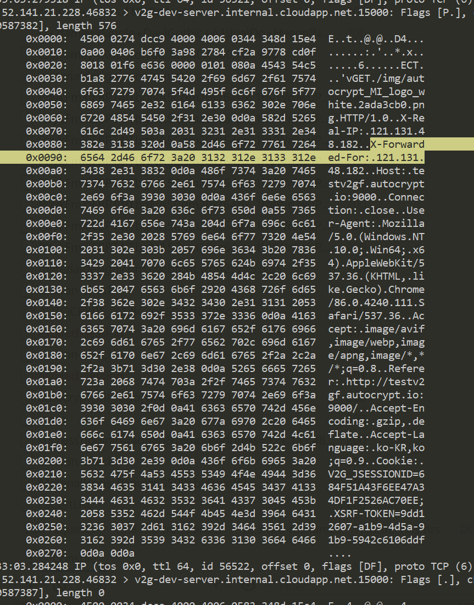

```bash
sudo tcpdump -vvX "dst port 15000"
```


<hr>

### # 자주사용하는 옵션
|옵션|설명|
|:---------------:|-----|
| -c [Number]   | 제시된 수의 패킷을 받은 후 종료한다. |
| -i [Device]   | 어느 인터페이스를 경유하는 패킷을 잡을지 지정한다. 지정되지 않으면 시스템의 인터페이스 리스트의 가장 낮은 번호를 가진 인터페이스를 선택(이 때 loopback은 제외) |
| -v, -vv       | 상세한 정보 출력 |
| -w            | 캡처한 패킷을 파일에 저장한다 |
| -r file       | 패킷들을 '-w' 옵션으로 만들어진 파일로 부터 읽어 들인다. |
| -x, -XXX      | 각각의 패킷을 헥사 코드로 출력한다. | 


### # Primitive
```cmd
//packet의 IP destination 항목이  HOST 패킷일 때 출력.
$ tcpdump -i any dst host 10.10.10.1

//packet의 IP source항목이 HOST패킷일 때 출력.
$ tcpdump -i any src host 10.10.10.1

//IP source, IP destination 항목 중 어느 하나라도 HOST 패킷일 때 출력.
$ tcpdump -i any host 10.10.10.1

//패킷이 ip/tcp, ip/udp 프로토콜의 패킷이고 destination port의 값이 PORT일 때 출력.
$ tcpdump -i any src port 23

//패킷의 source port의 값으로 PORT를 가지면 출력.
$ tcpdump -i any dst port 23

//port PORT : 패킷의 source, destination port 중에 하나라도 PORT이면 출력.
$ tcpdump -i any port 23

```
