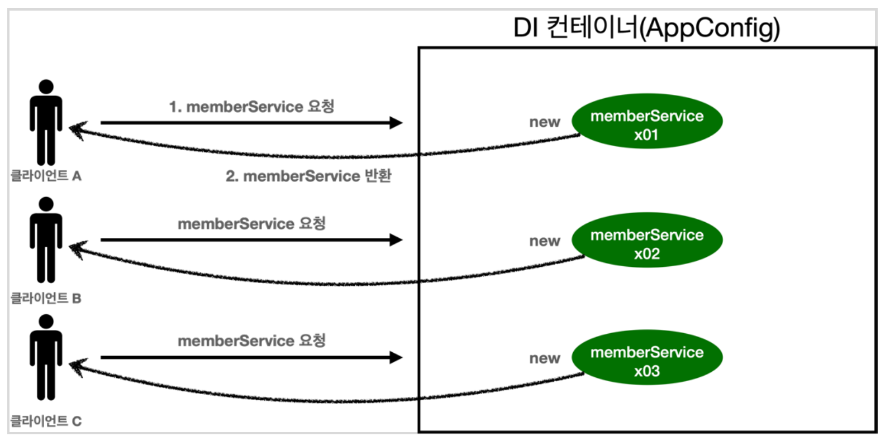
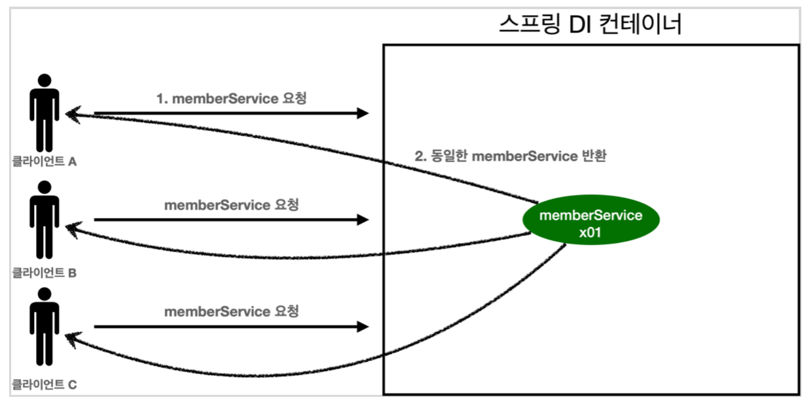

### 스프링 없는 순수한 DI 컨테이너 
* 요청시마다 객체를 새로 생성한다


```java
@Configuration
  static class AppConfig {
    @Bean
    DataService dataService() {
      return new DataServiceImpl();
    }
  }

  @Test
  @DisplayName("스프링 없는 순수한 DI 컨테이너")
  void pureContainer() {
    AppConfig appConfig = new AppConfig();

    // 호출시마다 객체를 생성
    DataService dataService1 = appConfig.dataService();
    DataService dataService2 = appConfig.dataService();

    // 참조값이 다른 것을 확인
    assertThat(dataService1).isNotSameAs(dataService2);
  }
```

### 싱글톤 컨테이너
* 스프링 컨테이너 덕분에 요청시마다 객체를 생성하는 것이 아니라, 이미 만들어진 객체를 재사용한다.
* 스프링 컨테이너는 싱글톤 컨테이너 역할을 한다.
* 이렇게 싱글톤 객체를 생성하고 관리하는 기능을 싱글톤 레지스트리라 한다.


```java
@Test
  @DisplayName("스프링 컨테이너와 싱글톤")
  void springContainer() {
    ApplicationContext ac = new AnnotationConfigApplicationContext(AppConfig.class);

    DataService dataService1 = ac.getBean("dataService", DataService.class);
    DataService dataService2 = ac.getBean("dataService", DataService.class);

    // 참조값이 동일한 것을 확인
    assertThat(dataService1).isSameAs(dataService2);
  }

```


### 싱글톤 방식의 주의점
* 무상태(stateless)로 설계해야 한다.
