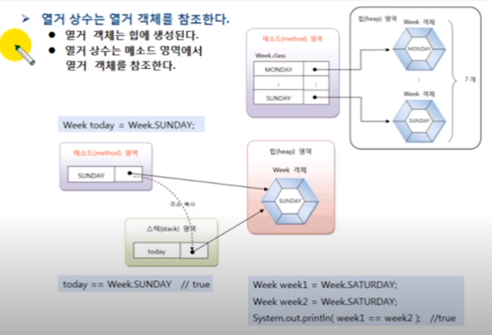
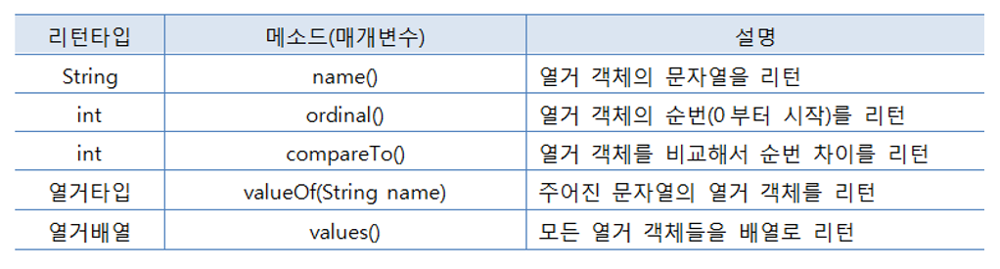

## 열거 타입(Enumeration Type)
- 한정된 값만을 갖는 데이터 타입
- 한정된 값은 열거 상수(Enumeration Constant)로 정의

## 열거 타입 변수
- 열거 타입 변수 선언
```
Week today;
```

- 열거 상수 값 저장 (열거 타입 변수값은 열거 상수 중 하나)
```
Week today = Week.SUNDAY;
```

- 열거변수는 참조타입
```
Week today = null;
```
열거 타입 변수는 참조 타입
열거 타입 변수는 참조 타입이므로 null 값 저장 가능

### 열거 상수는 열거 객체를 참조한다

```
Week week1 = Week.SUNDAY;
Week week2 = Week.SUMDAY;

System.out.println(wee1 == week2); // true
```
week1, week2 모두 참조 타입으로  
힙에 생성된 Week.SUNDAY 객체의 주소값을 가지고 있으므로
주소 비교시 true 가 출력된다.


## 열거 객체의 메소드
- 열거 객체는 열거 상수의 문자열을 내부 데이터로 가지고 있음
- 열거 타입은 컴파일 시 java.lang.Enum 클래스를 자동 상속  
   열거 객체는 java.lang.Enum  클래스의 메소드 사용 가능

```
Week today = Week.SUNDAY;
today.name(); // SUNDAY
today.ordinal(); // 0 (enum 순서는 0부터 시작)
today.valueOf("SUNDAY") // Week.SUNDAY
```
