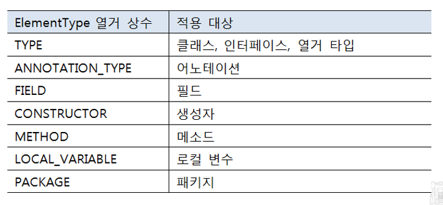

### Annotation
- 프로그램에게 추가적인 정보를 제공해주는 메타데이터(metadata)

#### 어노테이션 용도
- 컴파일러에게 코드 작성 문법 에러 체크하도록 정보 제공  
  ex) 메소드가 재정의 되었는지 확인할 수 있다. (@Override)

- 소프트웨어 개발 툴이 빌드나 배치 시 코드를 자동 생성하게 정보 제공  
  ex)xml 설정 파일을 자동 생성하거나 배포를 위한 JAR 압축 파일을 자동 생성할 수 있다.

- 실행 시(런타임시) 특정 기능 실행하도록 정보 제공  
  ex) 객체가 애플리케이션 내부에서 해야할 역할을 정의할 수 있다. (컨트롤러, 서비스 등)


#### Annotation 정의 및 적용

```java
// 정의
public @interface AnnotationName{
  String value(); //default 엘리먼트
  int elementName() default 5;
}

//적용
@AnnotationName("value 값");
@AnnotationName(value="value 값", elementName=3);
```

#### Annotation 적용 대상


#### 


