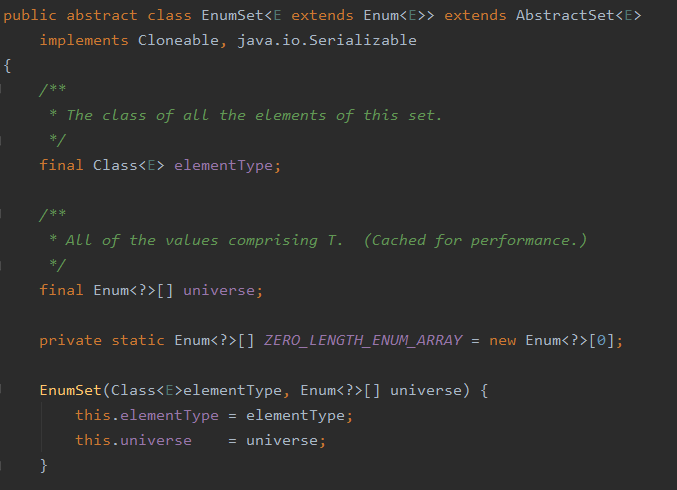
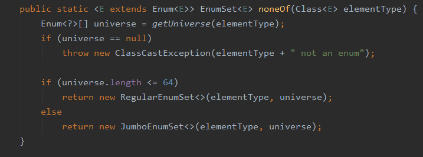

## 아이템1) 생성자 대신 정적 팩터리 메서드를 고려해라
정적 팩터리 메서드와 public 생성자는 각자의 쓰임새가 있으니 상대적인 장단점을 이해하고 사용하는 것이 좋다.
그렇다고 하더라고 정적 팩터리를 사용하는 게 유리한 경우가 더 많으므로 무작정 public 생성자를 제공하던 습관이 있다면 고치자.

### 정적 팩터리 메서드가 생성자보다 좋은 장점
#### 1. 이름을 가질 수 있다.
- 어떤 역할의 객체 생성인지 명시 가능
```
값이 소스인 BigInteger를 반환  
생성자 :            BigInteger(int, int, Random)
정적 팩터리 매서드 : BigInteger.probablePrime(int, Random)
```

#### 2. 호출될 때마다 인스턴스를 새로 생성하지 않아도 된다.
- [플라이웨이트 패턴(Flyweight pattern)](/history/posts/2020-10-04--004)  
  데이터를 공유하여 메모리를 절약하는 패턴, 
  공통으로 사용되는 객체는 한번만 사용되고 Pool에의해서 관리, 사용된다.
  (JVM의 String Pool에서 같은 String이 잇는지 먼저 찾는다. [불변객체 String])  
  
- 불변클래스  
  인스턴스를 미리 만들어 놓거나 인스턴스 캐싱으로 재사용하여 불필요한 객체 생성을 피할 수 있다.
  ex ) Boolean.valueOf(boolean b);
 
- 인스턴스 통제(instance-controlled) 클래스  
  정적 팩터리 방식의 클래스는 언제 어느 인스턴스를 살아 있게 할지를 철저히 통제할 수 있다.  
  싱글턴 / noninstatntialbe로 만들 수 있다.  
  불변 값 클래스에서 동치 인스턴스 하나임을 보장 ex ) Enum : 인스턴스가 하나만 만들어짐

#### 3. 반환 타입의 하위 타입 객체를 반환할 수 있는 능력이 있다.
- 생성자의 경우에는 반환형 클래스가 정해져있지만, static factory method 는 하위타입을 반환할수도 있다. 
- java.util.Collections 가 예시다

##### ps. Java8 인터페이스
- Default Method  
 -- default 키워드를 통해 메서드를 구현할 수 있다.   
    또, 이를 구현하는 클래스는interface의 메서드를 @Override 할 수 있다.
    
```java
public interface Coffee {  
  default String getBrandName() {
    return "MEGA";
  }
}
// getBrandName이 없는 DTO 클래스 생성
public class Americano implements Coffee {
  private long price;
  public Americano(long price) {
    this.price = price;
  }
}
// default 메소드에 적용되어있는 getBrandName() 메소드 사용
public class Test {    
  public static void main(String args[]) {
    Coffee coffee = new Americano();
    System.out.println(coffee.getBrandName());
  }
}
```
- 디폴트 메소드 vs 추상클래스 차이점  
 -- 인터페이스는 private 값을 가지지 못한다.(오직 public, abstract, default, static 상태만 가질 수 있다.)
 -- 인터페이스는 생성자를 가질 수 없지만 추상클래스는 생성자를 가질 수 있다.
 
참고 - 인터페이스에 대한 설명  
https://wedul.site/320   
https://m.blog.naver.com/heartflow89/220969525191


#### 4. 입력 매개변수에 따라 매번 다른 클래스의 객체를 반환할 수 있다.
- 하위타입이기만 하면 어떤 클래스의 객체를 반환하든 상관없다.  
 -- EX) EnumSet    
    -- 정적 팩터리 메소드인 noneOf() 에서,  
       원소가 64개 이하면 long 변수 하나로 관리하는 RegularEnumSet 을 반환하고,  
       65개 이상이면 long 배열로 관리하는 JumboEnumSet 을 반환
    -- 클라이언트에서는 이 두 객체의 존재를 모르고, 다음 릴리즈에서 이 내용을 변경할 수 있는 유연성을 가진다.




#### 5. 정적 팩터리 메스드를 작성하는 시점에서는 반환할 객체의 클래스가 존재하지 않아도 된다.
-- 다시


### 단점
- 정적 팩터리 메서드만 제공하는 클래스는 상속할 수 없다.   
  상속을 하려면 pubilc 이나 protected 생성자가 필요하기 때문이다.
- 정적 팩터리 메서드는 프로그래머가 찾기 어렵다.
  생성자처럼 API 설명에 명확히 드러나지 않기 때문에 프로그래머가 직접 정적 팩터리 메서드를 찾아야 한다.

### 정적 팩터리 매서드 명명 방식
- from  
 -- 매개변수를 하나 받아서 해당 타입의 인스턴스를 반환하는 형변환 매서드
```java
Date d = Date.from(instance);
```

- of  
 -- 여러 매개변수를 받아 적합한 타입으 ㅣ인스턴스를 반환하는 집계 메서드
```java
Set<Rank> faceCards = EnumSet.of(JACK, QUEEN, KING);
```

- valueOf  
 -- from과 of의 더 자세한 버전
```java
BigInteger prime = BigInteger.valueOf(Integer.MAX_VALUE);
```

- instance 혹은 getInstance  
 -- 매개변수를 받는다면, 매개변수로 명시한 인스턴스를 반환하지만, 같은 인스턴스임을 보장하지 않음
```java
StackWalker luke = StackWalker.getInstance(options);
```

- create 혹은 newInstance  
 -- instance 혹은 getInstance 와 같지만, 매번 새로운 인스턴스를 생성해 반환함을 보장한다.
```java
Object newArray = Array.newInstance(classObject, arrayLen);
```

- getType  
 -- getInstance와 같으나, 생성할 클래스가 아닌 다른 클래스에 팩터리 매서드를 정의할 때 사용
```java
FileStore fs = Files.getFileStore(path);
```

- newType  
 -- newInstance와 같으나, 생성할 클래스가 아닌 다른 클래스에 팩터리 매서트를 정의할 때 사용
```java
BufferedReader br = Files.newBufferedReader(path);
```

- type  
 -- getType과 newType의 간결한 버전
```java
List<Complaint> litany = Collections.list(legacyLitany)
```
