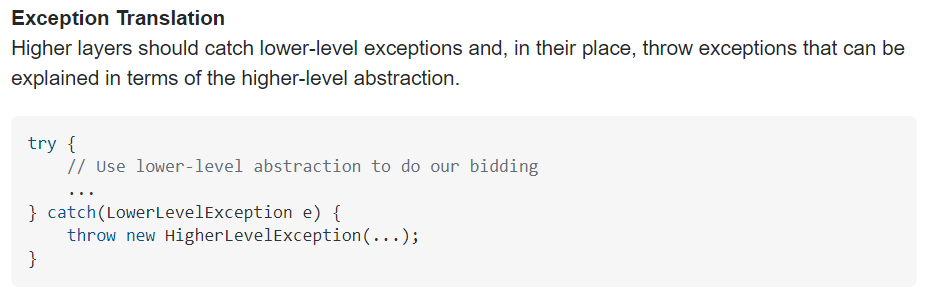
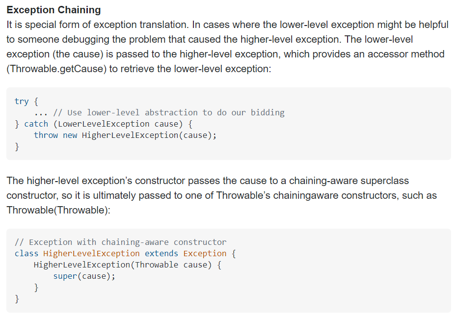

## 아이템73) 추상화 수준에 맞는 예외를 던져라
아래 계층의 예외를 예방하거나 스스로 처리할 수 없고, 그 예외를 상위 계층에 그대로 노출하기 곤란하다면 예외 번역을 사용하라.  
이때 예외 연쇄를 이용하면 상위 계층에는 맥락에 어울리는 고수준 예외를 던지면서 근본 원인도 함께 알려주어 오류를 분석하기에 좋다.

### 예외 번역 (exception translation)

### 예외 연쇄 (exception chaining)

