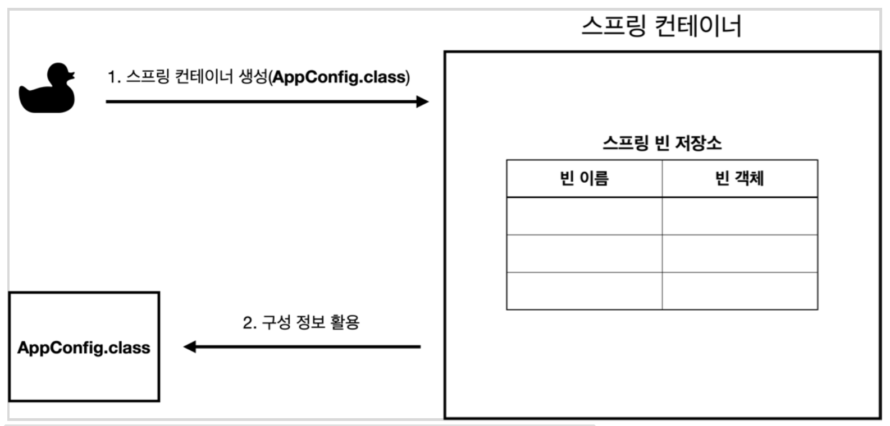
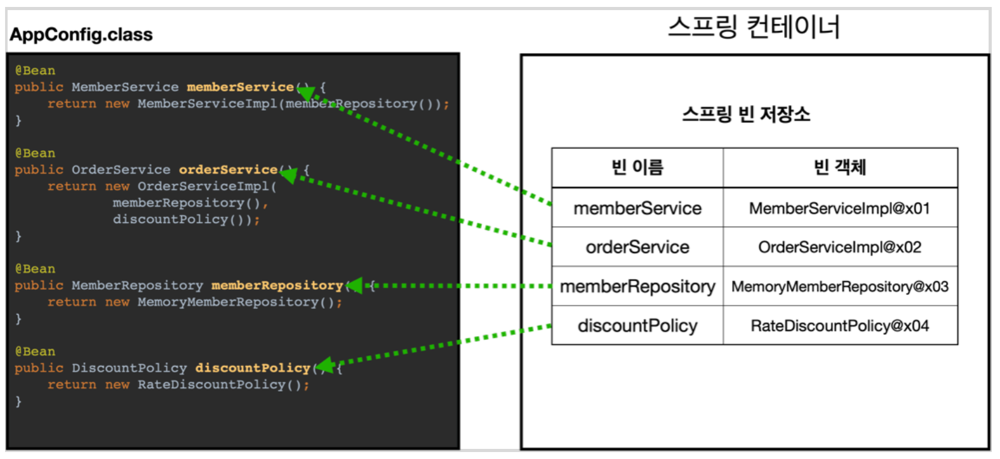
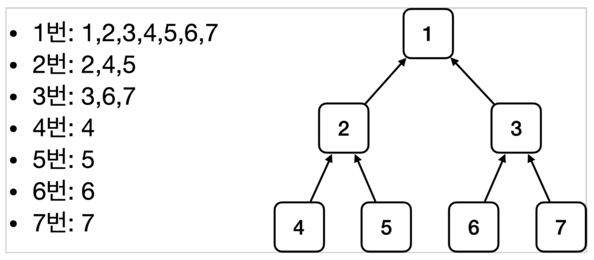

### # 스프링 컨테이너 생성

```java
ApplicationContext applicationContext 
      = new AnnotationConfigApplicationContext(AppConfig.class);
```




### # 스프링 빈 등록
* 빈 이름은 메서드 이름을 사용
* 빈 이름을 직접 부여할 수도 있다 @Bean(name"memberService2")




### # 스프링 빈 조회
```java
  AnnotationConfigApplicationContext ac 
          = new AnnotationConfigApplicationContext(AppConfig.class);
  @Configuration
  static class AppConfig {
    @Bean
    public DataService dataService() {
      return new DataServiceImpl();
    }
  }

  @Test
  @DisplayName("빈 이름으로 조회")
  void findBeanByName() {
    DataService dataService = ac.getBean("dataService", DataService.class);
    assertThat(dataService).isInstanceOf(DataServiceImpl.class);
  }

  @Test
  @DisplayName("이름 없이 타입으로만 조회")
  void findBeanByType() {
    DataService dataService = ac.getBean(DataService.class);
    assertThat(dataService).isInstanceOf(DataServiceImpl.class);
  }

  @Test
  @DisplayName("구체 타입으로 조회")
  void findBeanByImplName() {
    // 좋은 코드는 아니다.
    // 항상 역활과 구현을 구분해야 한다.
    // 그리고 역할에 의존해야 한다.
    DataService dataService = ac.getBean("dataService", DataServiceImpl.class);
    assertThat(dataService).isInstanceOf(DataServiceImpl.class);
  }

  @Test
  @DisplayName("빈 이름으로 조회 실패")
  void findBeanByNameX() {
    assertThrows(NoSuchBeanDefinitionException.class, 
        () -> ac.getBean("xxx", DataService.class));
  }
```


### 스프링 빈 조회 - 상속관계
- 부모 타입으로 조회하면 자식 타입도 함께 조회
- Object 타입으로 조회하면 모든 스프링 빈을 조회



```java
AnnotationConfigApplicationContext acExtends = 
          new AnnotationConfigApplicationContext(TestConfig.class);
  @Configuration
  static class TestConfig {
    @Bean
    public DataPolicy rateDataPolicy() {
      return new RateDataPolicy();
    }
    @Bean
    public DataPolicy fixDataPolicy() {
      return new FixDataPolicy();
    }
  }

  @Test
  @DisplayName("부모 타입으로 조회시, 자식이 둘 이상 있으면, 중복 오류가 발생한다.")
  void findBeanByParentTypeDuplicate() {
    assertThrows(NoUniqueBeanDefinitionException.class,
      () -> acExtends.getBean(DataPolicy.class));
  }

  @Test
  @DisplayName("부모 타입으로 조회시, 자식이 둘 이상 있으면, 빈 이름을 지정하면 된다.")
  void findBeanByParentTypeBeanName() {
    RateDataPolicy rateDataPolicy = acExtends.getBean("rateDataPolicy", RateDataPolicy.class);
    assertThat(rateDataPolicy).isInstanceOf(RateDataPolicy.class);
  }

  @Test
  @DisplayName("특정 하위 타입으로 조회")
  void findBeanBySubType() {
    RateDataPolicy rateDataPolicy = acExtends.getBean(RateDataPolicy.class);
    assertThat(rateDataPolicy).isInstanceOf(RateDataPolicy.class);
  }

  @Test
  @DisplayName("부모 타입으로 모두 조회하기")
  void findAllBeanByParentType() {
    Map<String, DataPolicy> beansOfType = acExtends.getBeansOfType(DataPolicy.class);
    assertThat(beansOfType.size()).isEqualTo(2);

    for (String key : beansOfType.keySet()) {
      System.out.println("key = " + key + " value = " + beansOfType.get(key));
    }
  }
```
